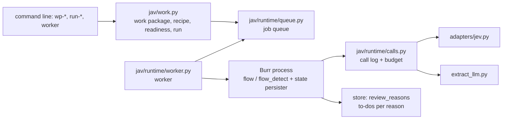
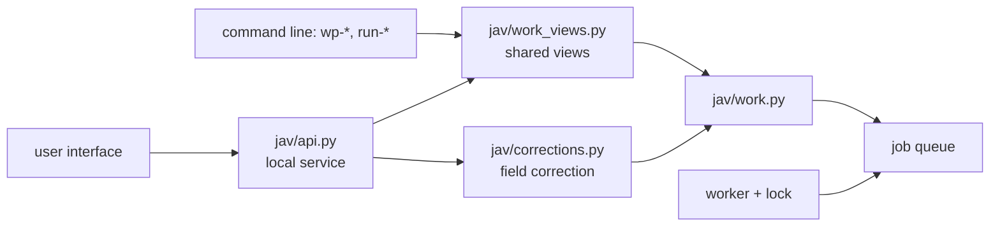
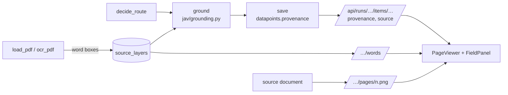
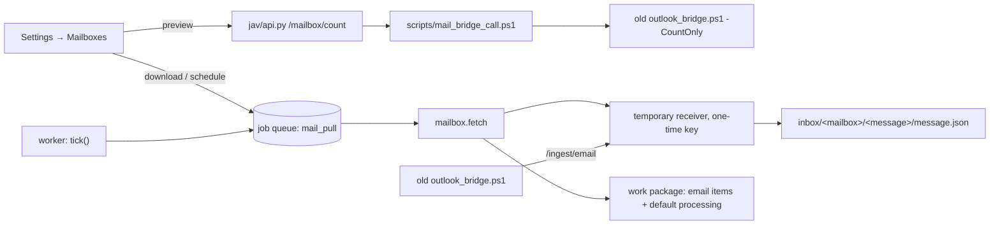

# Architecture — the end-to-end process and the five planes

**Date:** 2026-09-27, reviewed 2026-09-30 · **Status:** describes the structure that actually works. The guarantees of section 6 apply to the path that runs through the worker; the command-line measurement paths are outside them.

**Plain-language summary.** The system is a general framework for processing documents and emails with AI. Each flow
reads a document or an email, lets code, JEV and OpenAI each make the decisions they are suited to, and stores the
result, together with its to-dos, in a local database. Three reference flows show how it works: document type
recognition, invoice data extraction and email intent. Documents and emails go into work packages, whose runs a
background worker processes, reserving the cost before every paid call; a local service and a browser interface give
access to all of this. This page describes the process end to end, the five planes the flows share and the layers built
on top of them.

**What this is:** a general, multilingual document- and email-processing **AI-flow framework**
(Burr + Pydantic + sidecar + JEV) in which the flows are instances and the framework layer (adapter, registry schema,
call-site schema, policy schema, eval, store, contract, input adapters) is shared. The process below shows the three
reference flows (M1 document type recognition, M2 Hungarian invoice with two paths, M3 email intent); a new flow sits on the same
planes. The reference flows are the yardstick for the efficiency and reliability of the framework and of the
JEV–Pydantic AI–Burr combination. Teachable document processing is a complementary goal: a versioned processing recipe
for a known type, general data-point proposals with source checking for an unknown one. The shared source- and
structure-checking capabilities serve both; the learning branches (section 13) are not wired into the recognition and
intake path. OpenAI and JEV can both be used, for documents and emails alike; the division of labour between them is
decided per task by measurement (section 3).

**Package layout.** `jav/` is largely flat; the execution layer and the provider adapters are sub-packages
(`jav/runtime/`, `jav/adapters/`), and the trial runners live in `jav/experiments/`. The legacy project's database is
not a runtime dependency.

**Native document path.** Work packages also accept DOCX, XLSX, TXT and CSV. The worker dispatches these to
`jav/flow_native.py`; the readers preserve structured source elements, and `jav/native_results.py` stores immutable
readings and interpretation publications. Model calls use the existing provider adapters, receipts and budget ledger.
The API exposes complete source elements and source-linked facts to the native review views. Corrections retain the
original proposals, approval is bound to the displayed review version, and the shared result datasets include native
facts and reading status. PDF and email items keep their existing flows. A PDF whose recognised type has no fitting
type pack (a scan with the reader's local OCR) continues from detection into the native flow when the recipe's
`unknown_documents` setting is
`facts` (the default, 120); its result is then chosen by its native publication (`native_results.native_item`), not
by its suffix. The storage boundaries, failure states and
source-location contract are described in [Native document processing](guides/NATIVE_PROCESSING.md).

This page is written by hand. The generated parts are the graphs' `docs/flows/<flow>/FLOW.md` (in the repository), and
the JEV call-site catalogue and the state snapshot (local, generated from the store: `python -m jav.cli docs`,
`admin --write`). Rules: `CLAUDE.md` and the [development guide](guides/DEVELOPMENT.md); JEV capabilities:
`docs/JEV_PLAYBOOK.md`; security: `docs/SECURITY.md`; config files: `docs/guides/CONFIGS.md`.

## 1. The process from an email to a decision

```
 Settings → Mailboxes: download now, or a schedule (section 11)
        │
        ▼
 worker: jav/mailbox.py fetch (starts the temporary receiver below)
        │
        ▼
 scripts/mail_bridge_call.ps1
        │
        ▼
 old 10_AIFLOW_V4/scripts/outlook_bridge.ps1 (unchanged; reads desktop Outlook, read-only; -RepoRoot inbox/.bridge)
        │
        ├─► attachment files: inbox/.bridge/data/inbox/email/<acct>/<eid>/
        │
        │ POST /ingest/email
        ▼
 jav/ingest_server.py: temporary receiver on a free port, one-time key (the bridge protocol)
        │
        ▼
 inbox/<mailbox>/<msgid>/message.json (points to the attachment files)
        │
        ▼
 work package with the default processing (a person starts the paid run; the worker runs it)
        │
        ▼
 M3 email_intent graph (jav/flow_email.py)
 load_message → classify_attachments → intent → route → tasks → save
                         │                        │              │
                         │                        │              └─► store.emails + email_results + review_queue
                         │                        ▼
                         │            policy.email_next_flow (code) ──► m2:<type> · m1:detect · human:* · archive*
                         ▼
 M1 graph for each PDF (jav/flow_detect.py)
 load_pdf [→ ocr_pdf] → detect → save ──► store.documents
                        JEV: doc_type + issuer_hu + language (+ the detailed type)

 folder corpus (PDFs) ──► detect-corpus ──► M1 graph per document ──► store.documents (type × year report)

 store.documents (a type with a type pack; the detailed type) ──► M2 invoice graph (jav/flow.py; the type pack
 configs/types/<type>.json supplies the fields, questions, prompt and validators), two paths in one graph:
     load_pdf [→ ocr_pdf], then
     S: find_candidates (code) → jev_select (JEV Choice, 3 batched requests) → normalize_picks
     G: extract_llm (gpt, Pydantic AI) → jev_verify (code evidence + JEV Noul fan-out) → normalize_llm
        without JEV: extract_llm → code_verify (code evidence only, the word layer too; a value printed nowhere → source:not_found)
        (extract_llm also keeps the token probabilities of the answer's values: llm_token_p)
        → normalize_llm; when JEV is unavailable, jev_verify keeps the code evidence and the required-field check
     both → validate (code) → decide_route (policy) → ground (code) → save → done | needs_review
```

Each PDF attachment is also an item of the email's work package and gets the full document processing
(M1 + M2, section 10). The email input can still be driven by hand: an old bridge started without `-RepoRoot` posts to
`python -m jav.cli email-ingest-server` and keeps its attachments under the legacy project's `data/inbox/email/<acct>/<eid>/`;
the receiver resolves both attachment roots (`jav/ingest_server.py` `host_path`), and `email-inbox inbox/` then runs M3.

The **golden loop** is the same for every flow: golden set (referenced from the legacy project; the PII stays there) → run
with the cache ($0 thanks to the request hash) → report (`runs/*.jsonl` + Markdown) → discrepancy analysis from the raw
run → general rule (config change with a version bump) → rerun → determinism measurement without the cache. From live
data: a manual labelling list (`*_manual_sample.md`) → our own golden set (`golden_labels`).

## 2. The five planes

| Plane | What | Where | Control |
|---|---|---|---|
| **Flow** (Burr) | five graphs: the three reference flows and the two learning branches (section 13); `@action.pydantic` typed state, `run_id` = app_id, local tracker | `jav/flow.py`, `flow_detect.py`, `flow_email.py`, `flow_learning.py`, `flow_email_learning.py`; a `CONTRACT` at the end of each | `python -m jav.cli flows` lint + FLOW.md; tracker UI `burr` |
| **Decision** (JEV + GPT) | the families of JEV call sites: detect and detect_detail, email_intent, select (Hungarian, foreign, utility), verify (per type) — one file each under `configs/callsites/`; two generative steps: the G path's extractor (extract_llm) and the email task proposals (`configs/email_tasks.json`); the adapter (`jav/adapters/jev.py`) puts the concrete model version into the cache key, calls with a RetryPolicy and passes SDK errors on as `JevUnavailableError` | question sets `configs/callsites/*.json`, registries `configs/doc_types.json`, `intents.json`; code: `jav/detect.py`, `intent.py`, `jev_select.py`, `jev_verify.py`, `extract_llm.py` | `configs` (version, hash), the call-site catalogue (local, generated by `python -m jav.cli docs`), bands and routes in `configs/policy.json` (`bands` / `band_for`, `jav/policy.py`) |
| **Data** (SQLite) | documents · datapoints · emails · review_queue · ledger · golden_labels; also the tables for work packages, runs, the job queue, to-do reasons, the call log, email results, mailboxes and watched folders (full list: the `CREATE TABLE` statements in `jav/store.py`, `jav/work.py`, `jav/runtime/queue.py`, `jav/runtime/calls.py`, `jav/mailbox.py`, `jav/app_settings.py`, `jav/corrections.py`, `jav/source_layer.py` and `jav/legacy_import.py`); the process state lives in a separate store (`store/burr_state.sqlite`) | `store/jav.sqlite`, `jav/store.py` (additive migration) | `store` statistics (row counts of the core tables); the ledger records every AI call with its `config_hash` and, on failure, an `error` |
| **Measurement** (eval) | flow-independent list of judgements from the raw runs: accuracy and band per question, calibration (ECE), top-prob vs. conf, policy re-evaluation without calls, determinism | `jav/eval_report.py` (input `runs/*.jsonl`), the flow-specific runners `jav/evals*.py` | `eval-report` → `runs/<time>_eval_report.md`; golden / determinism commands per flow |
| **Administration** | config versions and hashes, models and prices, lint, golden results, review queue; session rules and hooks | `jav/cfg.py`, `configs/models.json`, `jav/admin.py`, `CLAUDE.md`, `.claude/settings.json`, `scripts/hooks/` | `admin` on one screen; hooks at session start, before compacting and at stop (a non-blocking reminder), plus a review agent; see the [development guide](guides/DEVELOPMENT.md) |

## 3. Where each decision is made — the decision hierarchy in practice

1. **Code** (deterministic, tested): candidate finders, validators, body cleaning, anchor features, evidence matching,
   `next_flow`, the review latch. This is the mechanism.
2. **JEV** (judgement over a finite set of options): one of the tools for selection, presence and verification steps. One call site = one JSON config
   + one `build_state` + one `build_questions` + one `jev.ask(...)` through the adapter. Raw probability goes into the state,
   thresholds only into `policy.json`: a named band set per call site (`band_for`), Noul no / uncertain / yes,
   Choice auto / uncertain / human (confidence threshold + gap to the second option); the `uncertain` band triggers review only
   with `uncertain_review: true`. Because of the request-hash cache, the same (concrete model version, state, questions) gives the same answer
   for $0; the alias (`jev-latest`) is resolved with a probe (`runs/cache/_model_versions.json`, 24 h TTL). If JEV still
   does not answer after the SDK retries, the adapter writes a ledger entry (`error`) and raises `JevUnavailableError`; the flows turn this
   into a `jev_unavailable:<reason>` review (M1/M3 `final_status = jev_unavailable`) instead of crashing.
3. **OpenAI, through Pydantic AI**: the existing G path and the document-learning branch produce structured proposals and then apply source checking. The graphs described here neither restrict OpenAI to generating extracts nor make JEV the only tool for every interpretive decision: further interpreting, classifying and verifying roles are also permitted, for documents and emails alike. Any new division of labour must be built in on the basis of targeted measurement; source checking, separate cost accounting and manual activation apply to every role. The Burr states are plain Pydantic models, not Pydantic AI.
4. **OCR pipeline**: `jav/ocr.py` + `configs/ocr.json` — PDF without text → page image (pypdfium2,
   300 dpi) → tesseract word boxes (native tesseract on the machine; the Hungarian + English language packs taken from the old sidecar's Docker image
   into `tools/tessdata`; fallback: the old sidecar image via `docker run`) → the same line/cell builder as for the text layer
   (`jav/pdf.py: build_layout`). A separate graph step (`ocr_pdf`) in the M1 and M2 graphs, a disk cache in `runs/ocr/`,
   raw quality signals in the state, thresholds in the `ocr` block of `policy.json`. The rest of the old sidecar (torch, the matcher)
   has not been ported. When local OCR is weak, `ocr_with_escalation` asks Azure DI (paid): since 121 directly over its REST API
   (`jav/adapters/azure_di.py`, standard-library HTTP, ported from the old sidecar's provider) when `AZURE_DI_ENDPOINT` and
   `AZURE_DI_KEY` are set, otherwise through the old sidecar, which sees only the legacy data folder. The call goes through the
   call log (`azure_recognise`): in a worker run the page count is reserved from the run's Azure budget (recipe switch
   `azure_ocr`); an analysis Azure accepted but whose result was lost is an uncertain call. A blocked or failed escalation leaves
   the local text and, unless the recipe switch is off, a to-do (`ocr:escalation_blocked:*`: budget, uncertain earlier attempt,
   no route to Azure, failed call). Heavy dependencies may only go behind a sidecar.
5. **Isolated PDF reading**: `jav/isolated_pdf.py` + `configs/service.json` `pdf_reader` — the third-party PDF parsers
   (pdfplumber for the text layer, PDFium for the OCR page images, the page sizes and the review page images) run in one
   long-lived helper process per calling process (worker, local service), one request at a time, with a time limit per
   request and a memory limit (on Windows a job object). Our own processing (words → lines and cells) stays in the
   calling process. Over a limit the helper is stopped and replaced; text extraction fails the item with a named error
   (`PdfReaderLimit`, no retry), the OCR page images give a to-do (`ocr:unavailable:PdfRenderLimit`), and a review page
   image is answered with 422. `isolated: false` runs the same functions in-process.

## 4. Tuning and changes — the procedure

| Change | Where | What follows |
|---|---|---|
| type or intent description (`what`), boundary (`not_for`), example (`examples`), family (`parent`) | `configs/doc_types.json` / `intents.json` (schema v2), bump `meta.version` + changelog | `detect-golden` / `email-golden` (new hash → live calls), `detect-determinism` / `email-determinism`; `eval-report` (parent-label section); regenerate `docs` |
| JEV instruction, Noul question | `configs/callsites/<callsite>.json` | the same; the local, generated call-site catalogue shows the statistics per version |
| band, threshold, route | `configs/policy.json` (`bands`, `band_for`, routes) | no rerun needed: `eval-report` shows from the raw runs (`runs/*.jsonl`) how many cases would change band |
| model, price, timeout, retry, cache version, alias TTL | `configs/models.json` | bumping `cache_version` invalidates every cache key; a model-version change (detected by the probe) produces a new key by itself |
| graph step | flow module + `CONTRACT` | `flows` lint + FLOW.md |
| code (regex, cleaner, validator) | `jav/*.py` + test (TDD) | `pytest`, `recall`, golden |

Pitfalls: a `use_cache=False` run **updates** the cache file (it refreshes the reference), except for the determinism measurement,
which runs under `JevAdapter.no_cache_write()`: no reads and no writes, so the reference answer stays untouched.
The old inbox folders contain attachments only; any change to a Choice criterion means a new cache key. The cache
key contains the concrete model version (introduced with `cache_version` 2): even a fully cached golden run
needs one probe a day (an API key is required; offline, the resolution stored in the file is used, with a warning).

## 5. What Claude needs to know to develop efficiently

- Session protocol: `CLAUDE.md` §2 and the [development guide](guides/DEVELOPMENT.md) §4; the hooks back it up
  (SessionStart / PreCompact / Stop / review). Session start: `python -m jav.cli preflight` (pytest + UI checks +
  contract lint + configs + git state + data guard + language guard + Ruff ratchet + the local state snapshot, among
  others). Never copy state numbers anywhere by hand: refer to the generated state snapshot.
- Designing a JEV question: `docs/JEV_PLAYBOOK.md` (facts from the docs, gap analysis per call site, checklist).
- A new JEV question: config JSON + `build_questions` (registry reference `registry:<name>`), the `docs.typesafe.ai` cookbook, a test
  modelled on `tests/test_cfg.py`, a golden run before and after.
- A new flow: module + `CONTRACT` + `TERMINALS` + `build_app` (tracker project in `models.json`) + lint + a golden runner
  modelled on `evals_*.py`; a flow never imports an SDK, only the adapter.
- Search the legacy project first (`CLAUDE.md` §3).

## 6. Execution layer: work package → run → worker

**Plain-language summary.** Documents go into a work package, the package gets its processing settings (or runs with
the default ones), and the run goes through a
durable job queue in the background. Before every paid call, an entry is written and the cost is reserved. After a stop,
the run resumes from the saved step, and a call that has already been paid for is not repeated. To-dos can be resolved
reason by reason, and a live run can only be approved when it has no open to-dos.



| Layer | File | Guarantee | Test |
|---|---|---|---|
| Work package, recipe, run | `jav/work.py`, `configs/recipes.json` | version conflict → `RevisionConflict`; readiness blockers; fixed input; idempotent start; approval only in live mode and with no open to-dos. A recipe has a `status`: `active` (offered in the UI; one since 1.8.0: `processing`), `internal` (`invoice-extraction`: a given document type, no recognition; command line and tests), `retired` (`document-processing`, `email-intent`: kept for old runs' titles and old assignments; `assign_recipe` raises `RetiredRecipe`). Without an assignment, readiness uses the default processing with its defaults (`assignment_default`) and `start_run` saves them in the same transaction; `migrate_assignments` / `processing-migrate` moves old assignments onto `processing`, keeping the settings (`carried_params`) | `tests/test_work.py`, `tests/test_processing_080.py` |
| Job queue | `jav/runtime/queue.py` | dedup key, claiming, attempts + back-off → `dead`, release, stop, handling of orphaned claims at start-up (modelled on the V4 `jobq.py`) | `tests/test_runtime_queue.py` |
| Call log, budget | `jav/runtime/calls.py` | reservation of an upper bound before the network call (UTF-8 bytes + a fixed overhead per request, growing conversation retries, transport retries; a call above its reservation stops the run's further calls with that provider); failed calls are logged too; an unknown cost stays reserved; an uncertain attempt is not repeated; a GPT question (`reusable`, its `request_hash` an `answer_key` of the model, instructions, schema, settings and text) gets an earlier answer to the same question when the run's earlier-answers setting allows it (`use_run(reuse=…)`, `worker.reuse_answers`): cost 0, noted `reused_answer:<id>`, a cached ledger row (`tests/test_gpt_reuse_090.py`); only an uncertain attempt can be settled by hand (one conditional write; a reserved one may still be running), and a late answer does not overwrite a settlement; a successful step is replayed; every reservation names its holder, a lock file next to the store (`call-holders/`) that the reserving process keeps locked for its lifetime, and a worker start makes uncertain only the reservations of holders that have stopped (or of reservations without a holder), so a command-line measurement waiting for its answer keeps its reservation (`holder`, `recover_uncertain`) | `tests/test_runtime_calls.py`, `tests/test_runtime_adapters.py`, `tests/test_reservation_holder_092.py` |
| Worker | `jav/runtime/worker.py` | stable identifier + Burr state persistence (`burr_state.sqlite` next to the store); resumption from the next step; stop at a step boundary; a changed source is rejected | `tests/test_runtime_worker.py`, `tests/test_work_cli.py` |
| To-dos | `jav/store.py` `review_reasons` | each reason is opened and closed by the step that raised it; human decisions carry an author | `tests/test_review_reasons.py` |
| Partial OCR | `jav/policy.py` `ocr_coverage_reasons` | a skipped page is always a to-do | `tests/test_ocr_coverage.py` |
| Email receiver | `jav/ingest_server.py`, `jav/emails.py` | paths stay inside the root, size and structure limits, mandatory key (without one it prints a one-time key at start-up), requests from a browser are rejected, replay protection by content hash | `tests/test_ingest_security.py` |
| Cost view | `jav/costs.py`, datasets `run_items` (cost columns), `runs` (`cost_usd`) and `package_costs`, the run view (`costs`), `ui/src/views/Runs.tsx` (`PlanVsActual`), `ui/src/views/PackageCosts.tsx` | the cost per item, run and package is read from what is already recorded, nothing is stored twice: the call log (a flow's call by the item's flow identifier, an Azure recognition by the document's fingerprint in its step) and the ledger (questions answered from an earlier JEV answer or an earlier Azure recognition, 0 USD); per provider and model: paid calls, failed and open among them, the known cost, and apart the reserved maximum of the calls without a known cost (not added to the cost); the pre-start overview is saved with the run (`runs.plan`) and each provider is shown as expected / possible / not expected next to the actual calls, with a warning when a provider was called against the overview | `tests/test_cost_view_082.py`, `ui/src/costView082.test.tsx` |
| Operational safety net | `jav/runtime/worker.py`, `jav/runtime/queue.py`, `jav/mailbox.py`, `jav/app_settings.py`, `jav/work.py` | the worker loop does not stop on an unexpected error (the job is closed and the error logged); an orphaned job is restarted at most 3 times and then marked dead; a stop requested while the worker was down is completed at start-up; a stop cancels the run's queued jobs and asks the running one to stop in one transaction (so the worker cannot finish the running item and refresh the run, or claim the next item, half-way through the stop), and a job that fails or is released after a stop request is cancelled instead of going back to the queue, so a stopped run always ends as stopped; an interrupted run start is completed on retry and is not "done" until then; emails that arrived before a download was interrupted still go into a package; a watched folder marks a file as seen only after it has been added successfully, and only one process scans a folder at a time; PDFium calls run under a lock | `tests/test_stability_063.py`, `tests/test_cancel_status_082.py` |
| Log, backup | `jav/runtime/applog.py`, `jav/backup.py` | permanent, rotating log (`runs/logs/`); store backup even while runs are in progress, with an integrity check (`python -m jav.cli backup`) | `tests/test_stability_063.py` |
| Daily backup, store thinning | `jav/backup.py`, `jav/runtime/persistence.py`, `jav/runtime/worker.py`, `scripts/backup-task.ps1`, `configs/service.json` `backup` | scheduled daily backup, verified copy to a second location, status file and UI warning; of a closed item's process states only the last one is kept (Burr `load` also reads only that one); `burr-prune` for a one-off thinning and compaction of the old store | `tests/test_ops_064.py`, `ui/src/ops064.test.tsx` |

**Limits.** The call log and the budget only apply on the path that runs through the worker (`calls.use_run`). The
command-line measurements (`golden`, `determinism`, `run` …) make their calls outside it, so that measurements stay
comparable with earlier ones; they do log failed GPT calls. Only one worker can run at a time (guarded by a lock, see
section 7). The email process is part of the same processing (the `processing` recipe chooses the flow per item kind, section 11), and it includes the attachments. The
experimental `TrialBudget` is separate and the experiments rely on it: it reserves an up-front call count and stops at
the cost already booked, instead of reserving the maximum cost of the next request.

## 7. Local service

**Plain-language summary.** The user interface and the command line use the same gateway: a service that can only be
reached from the local machine. It does not run anything itself; it only queues work and reads from the store. The
separate worker does the processing, so closing the browser or the service does not stop a run. A request that comes
from another machine or a web page, is too large, is not JSON or contains unknown fields never reaches the business
operation. Documents can be added from any existing local folder; a setting can restrict this to permitted
folders. Field corrections are versioned: a save based on an outdated version is rejected.



| Layer | File | Guarantee | Test |
|---|---|---|---|
| Gateway | `jav/api.py`, `configs/service.json` | loopback address only; `Host` and `Origin` checks; write requests must be JSON; body size limit, also for chunked transfer; Pydantic schemas that reject unknown fields; identifier patterns; folders and files: an existing path (links resolved), anywhere — with the `restrict_paths: true` setting, only under a permitted root | `tests/test_api.py` |
| Browser security headers | `jav/api.py` (`_SecurityHeaders`, the outermost layer) | on every response, including the gateway's rejections: framing forbidden (`X-Frame-Options: DENY`, `frame-ancestors 'none'`), `nosniff`, `Referrer-Policy: no-referrer`, COOP/CORP `same-origin`; on the UI's HTML a content security policy that allows only the app's own origin (`data:` for the embedded font and the favicon, `blob:` for downloads); `/api/` responses are `no-store` (page images included), with a locked-down policy; on the source PDF the policy only forbids framing (because of the browser's PDF viewer) | `tests/test_security_headers_071.py` |
| Version | `jav/version.py`, `pyproject.toml` | a single version source; `/api/health` returns the version and the commit recorded at start-up (`dirty`: uncommitted changes); the **System** (*Rendszer*) page shows it; `ui_build` (`version.ui_build`) fingerprints the UI build served now, and a tab whose commit or UI build differs from those at page load shows a reload banner (`ui/src/components/UpdateBanner.tsx`) | `tests/test_version_071.py`, `ui/src/version071.test.tsx`, `tests/test_version_banner_091.py`, `ui/src/versionBanner091.test.tsx` |
| Shared views | `jav/work_views.py` | the command line's `--json` output and the service's response are identical; money as text, not floating point | `tests/test_api.py::test_cli_and_service_give_the_same_answer` |
| Field correction | `jav/corrections.py` | version + 409 on conflict; only fields of the type pack; money and dates checked in code; forbidden on an approved run; the machine data is kept | `tests/test_api.py::test_correction_is_versioned_and_conflict_is_refused` |
| Verified fields | `jav/corrections.py` (`save(confirm=…)`, `reason_field`), `ui/src/review/FieldPanel.tsx`, `ui/src/review/fieldFilter.ts` | the ✓ next to a field saves that field, records it in the version (`confirmed`: field → value, kept while the value does not change) and resolves the document's to-dos on the field (the run's own and the earlier runs'); each to-do of a document item carries its field (`field`: the code's third or first part when it is a simple field of the pack); the panel filter To fix / Uncertain / All | `tests/test_field_verdict_083.py`, `ui/src/fieldVerdict083.test.tsx` |
| Worker lock, stop | `jav/runtime/lock.py`, `jav/runtime/worker.py` | operating-system lock (released automatically on a crash); a stop request takes effect after the item in progress | `tests/test_api.py` |
| Code loaded at start | `jav/runtime/preload.py`, `jav/runtime/worker.py`, `jav/api.py` (`serve`) | the worker and the local service import every module of the application (not `jav.experiments`) when they start, so a running process is one consistent state of the code it started from: a module changed on disk later (development in the same working tree) cannot mix in through a deferred import; a module that cannot be imported stops the start (`PreloadError`) | `tests/test_preload_091.py` |
| Start-up | `scripts/dev.ps1 start/status/stop` | service + one worker in the background, logs under `runs/dev/` | manual test |
| Folder and file picker | `jav/local_picker.py`, `jav/picker_dialog.py`, `configs/service.json` `picker` | `POST /api/local/pick-folder` and `/api/local/pick-files` open the operating system's own picker on the service's machine (the browser is on the same machine). The dialog runs in a separate process, one at a time (409 `picker_busy`); one left open past `timeout_s` counts as cancelled; no window possible → 503 `picker_unavailable`. The chosen path is checked like a typed one (403 `forbidden_path` under `restrict_paths`) | `tests/test_folder_browse_081.py`, `ui/src/folderBrowse081.test.tsx` |
| Package from a folder | `jav/work.py` `create_from_folder` | the folder's direct PDFs, or with `recursive` those of every subfolder; the output folder of the named copies is left out, and so is a link pointing outside the folder; in the views a subfolder document is titled with its path below the folder | `tests/test_folder_browse_081.py` |

**Error codes:** 404 unknown identifier · 409 version conflict, cannot be started or cannot be approved · 413 body too large ·
415 not JSON · 422 invalid input or missing author · 403 another machine, foreign origin or forbidden folder. Human
operations require the `X-Actor` header: decisions (approval, correction, closing a to-do) and also creating
and changing a package, the recipe, and starting or stopping a run or the worker. The machine-readable list of endpoints
on a running service: `/api/openapi.json` (the clickable `/api/docs` is switched off because it would load
program code from an external host).

**Limits.** There is no login and no permission system (a single-user local tool). We follow the V4 endpoint names
(`workflow`, `readiness`, `start`, `runs`); the work package resource is called `workpackages` instead of the V4 `intake-batches`. The report
endpoint returns the run's per-item result (machine data, correction, merged value); the export and the utility-cost report
are described in section 10 (Reports row).

## 8. User interface

**Plain-language summary.** The browser UI opens at the local service's address (`http://127.0.0.1:8930/`), with no
separate server. The main menu is **Work packages** (*Munkacsomagok*) + **Settings** (*Beállítások*) (section 10, UI structure row).
The UI contains no business rules. The service makes every decision (version, readiness, approval); the UI only displays
and forwards. Corrections are made next to the source document and are not lost when a save fails.

| Part | File | What it does | Behavioural guarantee (test) |
|---|---|---|---|
| App shell | `ui/src/App.tsx`, `ui/src/styles.css` | sidebar (two menu items), worker status, **Who is working?** (*Ki dolgozik?*) (with a non-empty name list, choosing from the list is mandatory; a **My work today** (*Mai munkám*) link) | `ui/src/users.test.tsx` |
| Routing | `ui/src/route.ts`, `ui/src/hooks.ts` | the selected package, run and item are in the URL (bookmarkable) | a package that has disappeared is not replaced by another one; an old response does not overwrite a newer one |
| Work packages | `ui/src/views/Workpackages.tsx`, `WorkpackageDetail.tsx` | list, creation from a folder or from files, **Items** (*Tételek*), Processing (processing settings, readiness with the pre-start overview, trial or live start) | on a version conflict the view reloads and the settings are kept |
| To-dos | `ui/src/views/ReviewWorkspace.tsx`, `ui/src/review/FieldPanel.tsx` | item list, source PDF, own and earlier to-dos (a field's to-dos at the field, the document's at the top), resolution per reason, ✓ / ✗ per field, field correction | the working copy survives network errors and conflicts |
| Run | `ui/src/views/Runs.tsx` | list, detail view with live updates during a run, budget bar, job queue, call log expanded, stop, approval | – |

**Technology.** React 19, Vite 8, TypeScript 5.9; tests: Vitest 4 + Testing Library (jsdom). 137 npm packages in total (2026-09-30),
no component library. The font (Geist) comes from a local package, so no internet access is needed. The build goes into `ui/dist/`
(git-ignored), and the service serves it at the root. The browser always re-requests the entry HTML. For development,
`npm run dev` (port 5173) forwards `/api` calls to the service. Preflight runs the UI's type check and tests if
`ui/node_modules` is installed.

**Limits.** The **Who is working?** name is not a login (there is no password) but the active user: with a non-empty name list, the service accepts only a name on the list for human operations. The Hungarian
field names are in a shared label configuration; a test checks that every field of every type pack has one. Section 9
describes how the source is displayed; the browser's PDF viewer has been retired.

## 9. Source-grounded review

**Plain-language summary.** When a run reads the text, it also saves where each word is (the word layer), and for every
extracted field it computes where the field is on the document (the source location). The review UI draws a box around
the selected field on the document's page image. It also shows the other candidates, and a field can be filled from words
selected on the image. All of this happens in code, without AI calls. If the location is ambiguous, there is no box,
only an explanation: no box is better than a wrong box.



| Part | File | What it does | Test |
|---|---|---|---|
| Word layer | `jav/source_layer.py`, `jav/pdf.py`, `jav/ocr.py` | page-relative boxes from the reader's set of words (text layer, local OCR, Azure), with a content-based identifier; the lines and the JEV requests are unchanged | `tests/test_source_layer.py` |
| Source location | `jav/grounding.py`, `configs/grounding.json` | S path: the selected candidate in its own line (text wrapped onto the following lines is followed in the same column) + the other candidates with their probabilities; if it cannot be found anywhere, an approximate box on the chosen line (`approximate`); search: comparison by kind, label context (V4 dictionary), part of a larger number excluded, names, addresses and texts over up to `multi_line_max_lines` lines of one column; an address also with its words in another order inside one column block (`address_unordered`) and without regard to punctuation; an identifier glued to a label word (never inside a longer number); several identifiers listed in one field found part by part (`search_parts`); a currency sign glued to an amount; a country's code against its printed name (`countries`); a label belongs to the first value after it, so a label with its own value beside it labels neither the lines below it nor the words beyond its value (for words, not for amounts and dates); a party heading (seller, buyer) also supports that party's address, tax number and country; several positions → no box, the positions become alternatives. The code's own source check of the G path without JEV (`code_verify`, also the fallback when JEV is unavailable) asks the same search (`printed`) when its line search finds nothing, so a field with a box is never reported as not printed; the JEV path's evidence lines are unchanged | `tests/test_grounding.py`, `tests/test_grounding_frames_092.py` |
| Process step | `jav/flow.py` `ground` | `decide_route → ground → save`; on an error the run continues without a source location | contract lint, `test_flow_run_saves_provenance` |
| Correction with a location | `jav/corrections.py` | selected words (`sources`) with a version; the valid location: manual > search for the corrected value > machine; the old box of a corrected field is only an alternative | `tests/test_api.py` |
| Endpoints | `jav/api.py`, `jav/page_image.py` | page image (PNG, 72–200 dpi, hash-protected), word layer, normalisation, settings | `tests/test_api.py` |
| UI | `ui/src/review/` | page image, box in the band's colour, clicking on the image, alternatives, selection (word, rectangle), working-copy store, splitter, keyboard shortcuts | `ui/src/behaviour.test.tsx` |

**Limits.** Old runs and documents read from the old OCR cache have no word layer (the layer is built during the
run). Line-item positions on the image: section 10, Boxes and line-item positions row. A correct box does not mean accuracy: the
box shows where the value comes from, not that the value is correct.

## 10. Unified document types

**Plain-language summary.** All 23 document types of the legacy project are complete type packs. After the broad category,
recognition picks the detailed type, extraction runs with that type's pack, and old results can be imported for
comparison.

| Element | File | What it does |
|---|---|---|
| Pack format | `jav/typepack.py`, `jav/models.py` | `list` field with an item description (`list_fields`), `boolean`, enumerated values (`enums`; a violation is a to-do); `arms`, `parent`, `auto_detect`, `detect` (old keywords) |
| Converter | `jav/typepack_convert.py` | old type copy (`configs/legacy_types/`) → pack + G-path verification call site; schema and prompt verbatim, provenance with the manifest's sha256 hashes |
| Statement rules | `jav/validators.py` → `jav/legacy_validation.py` | running balance, closing balance, totals, period — as record checks (an unchanged port of the old validator) |
| Detailed type | `jav/detect_detail.py`, `configs/callsites/detect_detail.json`, `policy.json detect_detail` | one candidate → that one; the old anchor score at the start of the document (V4 `anchor_check`), code decides when the lead is clear; otherwise JEV Choice with `none` (without JEV: the same question to GPT, method `gpt`); a type left open = to-do |
| Recognition without JEV | `jav/gpt_choice.py` (the shared call and probability arithmetic), `jav/detect_gpt.py`, `configs/gpt_detect.json`, `policy.json` `detect.doc_type.gpt` / `detect.detail_type.gpt` | the three questions of the JEV recognition (type, issuer's nationality, language) and the detailed type asked of GPT in one structured request each, with the JEV call site's document excerpt and question texts; each option offered with the first clause of its description; confidence from the answer's token log-probabilities (the product over the chosen value's tokens; an alternative token's branch credited to the one option it leads to); without log-probabilities the confidence is unknown and the type is a `detect:confidence_unavailable` to-do; a failed call (no budget, provider error) is a `detect:gpt_failed` to-do; a type or detailed type that presumes a Hungarian issuer while GPT's own issuer answer is in the `no` band is a `detect:issuer_mismatch` to-do, the type kept (a cross-check in code, `policy.issuer_mismatch_reason`, `policy.json` `detect_issuer`: GPT's type errors are confident, so its confidence cannot flag them); every call through the call log and the OpenAI budget (`tests/test_gpt_detect_086.py`, `tests/test_gpt_type_check_090.py`) |
| Field confidence without JEV | `jav/extract_llm.py` (`extract_scored`), `jav/token_confidence.py`, `jav/flow.py` (`_gpt_confidence` in `ground`), `policy.json` `gpt_field_confidence` | the extraction is a native structured answer with token log-probabilities (the saved answer carries a format mark; an answer saved before has none and is read without probabilities, and the reuse key includes the format); each top-level value is measured on the tokens that print it, quotes included (`joint` = product, `min`, `first`); on the G path without a JEV verification a field's confidence is the configured measure, capped by a failed field check (the source location does not cap it: GPT rewrites values, and in the measurement that cap flagged many right fields for few wrong ones), with its basis (`confidence_basis`) in the source location; without a token probability only a cap below 1 is shown; its own display band (`gpt_field_confidence.bands`, sent with `/api/settings` as `confidence_bands.gpt`; the review picks it by the basis, `bandsFor`); below `review_below` an accounting field (the pack's scored, not informational, and high-stakes fields) with a value and no failed check is a `gpt:low_conf:<field>:<p>` to-do, raised in `decide_route` from the same token probability (`policy.apply_gpt_confidence_policy`); a run with JEV never gets it, not even on the code's fallback when JEV does not answer; the JEV path keeps 1 − the strongest flag (`tests/test_token_confidence_091.py`, `tests/test_gpt_extract_logprobs_091.py`, `tests/test_gpt_field_confidence_091.py`, `tests/test_gpt_todo_092.py`) |
| Email intent without JEV | `jav/intent_gpt.py`, `configs/gpt_intent.json`, `policy.json` `email.intent.gpt` | the questions of the JEV email-intent call site (the intent among the registered intents, the yes/no signals, the urgency level) asked of GPT in one structured request, with the same email excerpt; each intent offered with its registry description and what it is not for; confidence and P(yes) from the answer's token log-probabilities, as above; the signals route and flag as with JEV (`email.signal`); an unmeasurable confidence is an `intent:confidence_unavailable` to-do, a failed call an `intent:gpt_failed` to-do; a test never sends such a question to OpenAI (the suite's guard in `tests/conftest.py`; `tests/test_gpt_intent_089.py`) |
| Recipe | `configs/recipes.json` `processing` (flows per item kind; before recipes 1.8.0 `document-processing`), `jav/runtime/worker.py` | a document: recognition → extraction with the detailed type's pack, the path is the one requested if the pack supports it; an email: intent + attachments (section 11). The `jev` setting off: no JEV budget for the run (`param_item_usd` `drop`), GPT recognition, every document on the G path with `code_verify`, GPT recognises an email's intent (0.07 USD OpenAI per email; before recipes 1.10.0 an `intent:jev_off` to-do) and its attachments are recognised only as items of their own. The interface shows `arm` and `jev` as one setting, the processing path (`path`: auto / S / G / gpt; jev / gpt for a package of emails only; `ui/src/labels.ts` `shownParams`, `pathValue`, `applyPath`); the saved settings keep the two values (`tests/test_no_jev_switch_086.py`, `tests/test_gpt_intent_089.py`, `ui/src/pathPicker090.test.tsx`) |
| Invoice line items | `configs/types/{invoice_hu,*_szamla}.json`, `jav/validators.py`, `jav/policy.py` | `line_items` list with the item fields of the GPT schema; `line_items_total` (sum of the items = invoice total; it is enough if one side, net or gross, is complete) and `line_items_arithmetic` (arithmetic per line; not on MOHU invoices); `"review": false` = flag only (`CheckResult.advisory`; the to-do rule skips it); `default_arm` + recipe `arm=auto` (utilities: G) |
| Boxes and line-item positions | `jav/grounding.py` (`locate_value`, `locate_rows`, `ground_lists`), `jav/reground.py`, CLI `reground`, `ui/src/review/PageViewer.tsx` | a value that appears in several places: box at the most probable position (`multiple`, alternatives); currency signs ("Ft"); table columns are not merged into one number; the list's rows in `provenance[<list>].rows`; recomputing an existing run (the position chosen during the run is kept); on the image every box is drawn faintly and the selected one strongly |
| Reports | `jav/export.py`, `jav/report_utility.py`, `configs/reports.json`, API `/runs/{id}/export`, `/runs/{id}/reports/utility-cost`, `ui/src/views/UtilityReport.tsx` (in the package's **Result** (*Eredmény*) stage) | export from the run's valid data (`run_records`: machine + correction, valid source location, open to-dos); CSV with `;` + BOM + formula protection, XLSX text is never a formula; utility grid: daily pro-rating with Decimal, duplicate (type + invoice number) and settlement invoices, the water summary is informational only; the old `tabular.py` and `csv.ts` helpers ported |
| Unified data view | `jav/tablequery.py`, `jav/datasets.py`, `configs/datasets.json`, `configs/field_labels.json`, API `GET /datasets`, `POST /datasets/{name}/query`, `POST /datasets/{name}/export`, `ui/src/components/` (DataTable, Picker, DatasetPicker, DownloadPanel, Popover), `ui/src/views/ResultStage.tsx` (the package's Result stage) | datasets with column descriptions; search (accent-insensitive), column filters, Hungarian collation (ö/ő and ü/ű as separate letters; in a mixed text column, pure numbers sort as numbers), paging in the service; the run's data (`datasets.run_records`) is cached per fingerprint and shared by the tables, the utility report and the full export; download of all / filtered / selected rows with chosen columns (using the CSV and XLSX writers of `jav/export.py`); UI: TanStack Table 8 + Virtual (above 80 rows only the visible rows are rendered) |
| UI structure | `ui/src/App.tsx`, `ui/src/route.ts`, `ui/src/views/WorkpackageDetail.tsx` (+ `ProcessStage`, `ResultStage`, `DocumentsPanel`), `ui/src/views/Settings.tsx` (+ `settings/`), `jav/work_views.py` `next_step`, `jav/work.py` `start_run(rerun_of=)` | main menu: Work packages + Settings; package stages process / review / result (**Processing** (*Feldolgozás*) / **Review** (*Ellenőrzés*) / **Result**), old URLs redirected; the next step is computed in the service, as a code + parameters, and the UI translates it |
| Settings | `jav/app_settings.py`, API `/settings/users`, `/settings/folders`, `/settings/folders/{id}/scan`, `app_settings.tick()` in the worker loop | user name list (local store); watched work folders the V4 way (one shared / daily package, recipe, frequency), any existing folder (with the restriction on, only under a permitted root), read-only, a file already seen (path + size + mtime) is not hashed again, a removed document does not come back, no run starts by itself |
| Users and assignment | `jav/app_settings.py` (`canonical_user`), `jav/api.py` (`human_actor` → `UnknownUser` 403 `unknown_user`; creating a package, its items, the recipe and starting a run are human operations too), `jav/work.py` (`workpackages.owner`, `set_owner`), API `/workpackages/{id}/owner`, `jav/activity.py`, `jav/datasets.py` (`workpackages` `owner` scope, `activity`), `ui/src/views/Activity.tsx`, `ui/src/hooks.ts` (`useActor`, `useEvent`) | no password; with an empty name list any name is accepted (first setup); the name is stored in the spelling used in the list; the **Assignee** (*Felelős*) is not a permission; the activity log is built from the existing rows that carry an author (package events, recipe, run start / approval, correction, closing a to-do, task decision, mailbox download); a day is the local calendar day |
| Run start with confirmation | `ui/src/views/StartConfirm.tsx`, `ui/src/route.ts` (`#/workpackages/{id}/process/start?mode=…&rerun=1`) | the run buttons lead to the confirmation page; it shows a summary (mode, package, processing settings, number of items, maximum cost per provider), the pre-start overview (`work.run_plan` → `readiness.plan`, `labels.ts` `planLines`: per service the budget and what it is for, and the services that will not be called) and the only start button |
| Package management, status, fingerprint | `jav/work.py` (`archive_/restore_/rename_/delete_workpackage`, `workpackage_events`, `resolve_reason`, `fingerprint` + `file_fingerprints`), API `/workpackages/{id}/archive|restore|rename|delete`, `jav/work_views.py` `result_tables`, `ui/src/views/WorkpackageActions.tsx` | hiding = `workpackages.status='archived'` (the list asks for hidden packages with the `include_archived` scope); deletion only when there are no runs, with an event log; closing a to-do updates the state of the run it belongs to; readiness and the page image use a hash remembered by size + mtime, the start and the worker a full one; the Result views come from the run's data (`tables`) |
| Emails in the processing | `jav/store.py` (`email_results`), `jav/emails.py` (`body_coverage`), `jav/flow_email.py` `save`, `jav/mailbox.py` (`email_result_for`, `effective_email_result`, `add_attachments`), `jav/corrections.py` (`_save_email`), `jav/export.py` (`email_records`, `emails_table`), `jav/datasets.py` (`emails`), `jav/work.py` (`parent_item_id`, `flow_for`, `run_budget`), `configs/recipes.json` `processing` (before recipes 1.8.0 `email-intent`) | the email result is stored per run; the share of the text that was seen is computed in code; intent correction is versioned, the next step is derived in code from the corrected intent, and the intent to-do closes with the decision; a PDF attachment becomes a document of the package that points to its email, and the recipe chooses the flow (`flows`) and the budget (`max_item_usd_by_kind`) per item kind |
| Task proposals | `jav/email_tasks.py` (proposals from GPT through the call log and the budget, `gate`), `jav/flow_email.py` `tasks` step (route → tasks → save), `configs/email_tasks.json`, `jav/prompts/email_tasks_prompt.md` (the old v1.3.0 verbatim), `store.email_results.tasks` + `email_task_decisions`, `jav/mailbox.py` (`task_view`, `decide_task`), API `/runs/{id}/items/{item}/tasks/{n}/decision` and `/tasks/{n}/done` (manual **Done** (*Elvégezve*), `email_task_decisions.done_by` / `done_at`), `jav/datasets.py` `email_tasks` | the recipe's `tasks` parameter (off by default); no call on the archive route (code); the gate applies the old rules (verbatim quotations only from the subject / body, a YYYY-MM-DD deadline, a verbatim assignee), and an invalid proposal drops out with a reason code, together with its content, the part that failed (`failed_parts`) and a check per quotation (`quotes`); identical proposals within one email are merged (`merged`); a proposal becomes a to-do that closes after the human decisions |
| Language and appearance | `ui/src/i18n/` (t, useLocale, en-*.json), `ui/scripts/check-i18n.mjs` (+ `--audit`, part of preflight), `ui/src/appearance.ts` | the V4 i18n pattern ported: Hungarian keys, and the English dictionary is loaded only when switching to English; labels that come from the service (dataset columns, enumerated values, field, type and recipe texts) must be translated too; theme (light / dark / system) and density per viewer |
| Old results | `jav/legacy_import.py`, CLI `legacy-import` / `legacy-compare` | the old batch exports are only read, by sha256, into a separate table (`legacy_results`); comparison = agreement, not accuracy |
| Capability catalogue | `configs/capability_catalog.json`, `jav/capability_catalog.py` (`python -m jav.capability_catalog`) | links the type and intent registries, the type packs and the legacy packs; builds a deterministic catalogue without any calls, using the existing loaders, with the effective schema, nested field paths, the recognition description, status and source hashes; the existence of a pack is not automatic evidence for routing; the config appears in the usual `cfg` version / hash report |

**Line lists in the UI.** Correcting a `list` field replaces the whole list, and each cell is
checked against the item field's kind and enumerated values (`jav/corrections.py` `list_columns`, `_check_list`). The item
result (`item_result`) also returns the list's columns (`lists`) and the pack's checks on the corrected data (`checks`, with `rows` for
errors that point at rows). In the UI the right panel's tabs are **Fields** (*Mezők*) / one tab per list (`ui/src/review/ListTable.tsx`); a
list tab keeps its own image-to-panel ratio. List rows have boxes on the image (the Boxes and line-item positions row). Tests: `tests/test_list_corrections.py`,
the line-list block of `ui/src/behaviour.test.tsx`.

`documents.doc_type` is the broad category and `documents.detail_type` the detailed type; `datapoints.doc_type` is the
pack used for extraction. The old type copies remain as sources (hash-checked); the separate old runner
(`jav/legacy_runtime.py`) has not been retired yet.

## 11. Mailbox reading and scheduling

**Plain-language summary.** In the **Mailboxes** (*Postafiókok*) section of Settings you choose which mailbox to read
and for which period. First you can ask for a free preview of the message count, then start a one-off download or a schedule (default: hourly). The worker does the download with the old Outlook script. New
emails become a work package with the default processing; a person starts the paid processing. Outlook must be running
on the machine.



| Element | File | What it does | Test |
|---|---|---|---|
| Preview, download | `jav/mailbox.py` `count`, `fetch` | the old script, unchanged; its project root is `inbox/.bridge` (attachments, "already read" list), not the legacy project; all messages (`-AllEmails`); a work package from the new / changed messages | `tests/test_mailbox.py` |
| Temporary receiver | `jav/ingest_server.py` `make_server(0, token=…, on_ingest=…)` | free port, one-time key; the existing replay protection (identical content = replay) | `tests/test_mailbox.py`, `tests/test_ingest_security.py` |
| Download log, schedule | `jav/mailbox.py` (`mailbox_pulls`, `mailbox_schedules`), `jav/runtime/worker.py` | every download is a job-queue task; the worker calls `tick()` on every loop; an error goes to the log and is not retried | `tests/test_mailbox.py` |
| Email item | `jav/work.py` `add_items(kind="email")`, `review_subject`; `configs/recipes.json` `processing`; `jav/flow_email.py` (`run_id`, state persistence) | item = the email's `message.json`; the subject of the to-dos is the email's identifier | `tests/test_mailbox.py` |
| UI | `ui/src/views/Mailbox.tsx`, `ui/src/review/EmailReview.tsx` | form, preview, download, schedules, log; in the review workspace, the email and its intent | `ui/src/behaviour.test.tsx` |

Limitation: the download runs in the worker's thread (possibly for minutes), and document items make no progress in the
meantime. Manual intent correction and attachment processing are described in section 10 (Emails in the processing
row): a PDF attachment runs in its email's package with the same processing, not in a separate document work package.

## 12. Data checks, limits and safeguards

**Plain-language summary.** The system is deliberately strict in several places. It checks tax numbers against
recognised formats and the check digit, it does not claim false certainty for a field with no candidates, a damaged
glyph does not turn into a negative amount, and a document without a type pack gets a to-do. The
input limit stops documents that are too large, and the PDF parsers run in a separate helper process with a time and
memory limit, so a broken PDF cannot hang the worker or the service. On the code side the data guard protects what goes to GitHub, on the
browser side the security headers protect the UI, and the running version is visible. The full security picture:
[security notes](SECURITY.md).

| Element | File | Guarantee | Test |
|---|---|---|---|
| Tax number | `jav/taxid.py`, `jav/validators.py` `tax_id` | recognised format (Hungarian domestic, Hungarian EU VAT (*közösségi adószám*), other EU and some non-EU); the label is stripped; for Hungarian numbers the check digit, VAT code and county code are checked; anything unrecognisable is a to-do, which names the field (`validator:<code>:<field>`, as every failed field check does, so it stands at that field in Review) | `tests/test_taxid_069.py`, `tests/test_properties_067.py`, `tests/test_validator_field_090.py` |
| Field without candidates | `jav/jev_select.py` | a "no estimate" flag and a presence question; an empty field never gets 100% | `tests/test_no_candidate_field_069.py` |
| Lost glyph | `jav/pdf.py` `fix_lost_glyphs` | a damaged currency sign does not produce a hyphen (a negative amount) | `tests/test_lost_glyph_069.py` |
| Document without a type pack | `jav/flow_detect.py` | a recognised type that has no pack gets a to-do | `tests/test_no_type_pack_069.py` |
| Input limit | `configs/service.json` `input_limits`, `jav/pdf.py`, `jav/ocr.py`, `jav/page_image.py` | file size, page count, page-image pixels; above them a named error or a to-do | `tests/test_input_limits_067.py` |
| Number reading | `jav/numbers.py` (used by `jav/candidates.py`, `jav/models.py`, `jav/jev_verify.py`, `jav/corrections.py`, `/api/normalize`) | one reader for every path: a number is matched and read whole, never cut apart; both a dot and a comma: the last one is the decimal separator; money never has three decimals, so "28.000" and "28,000" are 28 000; a quantity follows the document's own notation (`document_convention`: decisive numbers such as "1 234,56" or "28,000.00", dates left out), and is flagged when that is unknown; a flagged reading becomes a `money:separator_ambiguous` to-do; a GPT value in the contract form (a dot decimal with one or two decimals, or with four or more, such as a unit price "37.4510" per kWh) is taken as it is, and a value GPT copied in the document's notation is read the same way as printed text; on the S path a picked number that is only a piece of a longer printed number gives `money:token_cut`; manual input follows the Hungarian habit and an ambiguous form is refused (422 `ambiguous_number`); the stored form is canonical ("28000") | `tests/test_number_reading_081.py`, `ui/src/numberEdit081.test.tsx`, `tests/test_normalize.py`, `tests/test_properties_067.py` |
| Date reading | `jav/dates.py` (used by `jav/candidates.py`, `jav/models.py`, `jav/jev_select.py`, `jav/jev_verify.py`, `jav/corrections.py`, `/api/normalize`) | one reader for every path and every candidate profile: a date is read whole, never cut out of a longer number; year first, month names and abbreviations in six languages (any case, with or without accents, ordinal endings), two-digit years by a fixed rule, a time or weekday beside it; a four-digit year is 1900–2099; in an all-number date a number above 12 decides the order of day and month, then the document's own order (`document_date_order`: its hyphen and slash dates with a four-digit year that a number above 12 decides); a dot date is day first; without the document's order a hyphen date stays day first and a slash date, or an all-number date with a two-digit year (it may be the Hungarian short form with the year first), is flagged (on the Hungarian and utility profiles such a date is a candidate only when the document's order resolves it, as elsewhere it is mostly a code): picked on the S path or returned by GPT it gives a `date:order_ambiguous` to-do, and the JEV option text does not change; manual input takes every unambiguous form and refuses an ambiguous one (422 `ambiguous_date`); the stored form is ISO. The two Hungarian patterns of `jav/models.py` stay unchanged, because the type recognition request counts their matches | `tests/test_date_reading_084.py`, `ui/src/dateReading084.test.tsx`, `tests/test_normalize.py`, `tests/test_properties_067.py` |
| Isolated PDF reading | `jav/isolated_pdf.py`, `configs/service.json` `pdf_reader` | a PDF that hangs a parser or exhausts memory stops only the helper process: a named error, a to-do or a 422, and the next document gets a new helper; a document over a limit is not retried; an email's unreadable PDF attachment is marked `unreadable` and gives the email a to-do, while its intent still runs | `tests/test_isolated_pdf_077.py`, `tests/test_runtime_worker.py`, `tests/test_attachment_unreadable_078.py` |
| Data guard | `jav/data_guard.py`, `scripts/githooks/`, `configs/data_guard.json` | before a commit and a push: real-looking data, keys, internal working documents, documents and binary files stop it; a push is also refused when it would carry a commit listed as forbidden in the configuration | `tests/test_data_guard_071.py` |
| Security headers | `jav/api.py` `_SecurityHeaders` | see the table in section 7 | `tests/test_security_headers_071.py` |
| Version | `jav/version.py` | see the table in section 7 | `tests/test_version_071.py` |

## 13. Experimental modules

**Plain-language summary.** Besides the three reference flows, the code base contains experiments that try out new
combinations of OpenAI, JEV and code: learning an unknown document or email type, assessing claims against the source,
and comparing two independent decisions. Their outputs are candidates for a person to review, not production results,
and everyday processing does not depend on them.

The worker, the local service and the reference graphs (`flow`, `flow_detect`, `flow_email`) import none of the modules
below. The command line reaches the document-learning branch through its own commands (`learn-flow` and related), and
its contract lint (`flows`) also checks both learning graphs; the other modules are called as libraries, mostly from
the trial runners in `jav/experiments/`.

| Module | File | What it does |
|---|---|---|
| Document-learning branch | `jav/flow_learning.py`, `jav/learning_runtime.py`; [contract](flows/document_learning/FLOW.md) | a Burr graph: explicit generating model or imported proposal → JEV → unchanged record; JSON state, durable SQLite Burr persistence, its own external-response log and an exclusive reservation per working directory; not wired into the recognition and intake path |
| Excerpt bundles for long documents | `jav/evidence_learning.py` | puts an excerpt bundle of at most 8000 characters, traceable to the original source positions, in front of the document-learning graph; excerpts are chosen explicitly, not by automatic search, and a marker or a skipped part is not a source quotation; the general verifier has an optional field-format gate and a unique exact-context expansion that is off by default; the local record, the support valid for the selected context and the unestablished correctness of the document are kept separate |
| Email-learning branch | `jav/flow_email_learning.py`, `jav/source_evidence.py`, `jav/email_learning_runtime.py`, `jav/email_review.py`; [contract](flows/email_learning/FLOW.md) | an opt-in Burr graph: baseline answer → source scan → source-based intent → candidate save; source candidates with their original positions from the shared lossless chunker, with scanning and selection handled separately; an injection signal measured over the full chunk scan must not be lost in the final excerpt selection; its own response log and resumption; manual view / label / export; candidates are not activated and are not a golden set, and M3 and its thresholds are unaffected |
| Claim assessment | `jav/claim_assessment.py` | for document and email sources: exact source bundle → OpenAI interpretation → standalone JEV role / state → JEV proposal check → unchanged candidate record; its own response log and SQLite reservation, following the pattern of the learning runner; a file-based experiment, not a Burr graph; `review_proposal` keeps optional role / state support signals alongside the aggregated answer; every result is `candidate_only` with `correctness=not_established` and needs manual review; the claim identifier is not business entity resolution |
| Matter review | `jav/matter_review.py` | an isolated Burr experiment: GPT decision → independent native Pydantic AI / JEV decision → comparison in code; its own SQLite work lock, an immutable identity, a pre-call marker and a saved response; an interrupted call is not repeated, and the final state is read back without depending on a provider; it only produces candidates and writes no production case link |
| GPT and JEV comparison | `jav/experiments/stack_trial.py`, `jav/experiments/gpt_jev_comparison.py` | runs the G path of the invoice graph with a separate generator identity (an `extract_llm.use_agent_factory` dependency limited to the trial); `gpt_jev_comparison` stops after GPT, records the baseline without JEV, then continues from the same point along the original verification branch; not a new graph |
| Legacy-pack runner | `jav/legacy_packs.py`, `jav/legacy_runtime.py`, `jav/provider_generation.py`, `jav/experiments/expansion_trial.py` | strict Pydantic schemas for the hash-checked legacy packs; a service on the document-learning graph (GPT extraction → code validation + JEV field support → save) with its own SQLite / Burr state and response log, used with explicit type selection; the typed GPT output is saved before the usage data is processed; the recipes extract with the converted type packs of section 10, and this runner has not been retired yet |

## 14. Content-based file names

**Plain-language summary.** After a run, the system can make copies of the processed documents under uniform names built
from their content, for example `2026-09-12_SZAMLA_Minta-Kft_SZ-2026-001234.pdf`. The original files are only read,
never renamed or changed. The name comes from the run's valid data (the machine value with any human correction), in
code, with no AI call. A copy whose name rests on something uncertain goes into a separate review subfolder, and a
manifest lists which original became which name.

| Part | File | What it does | Guarantee (test) |
|---|---|---|---|
| Naming rules | `configs/naming.json`, `jav/naming.py` (`name_for`, `review_reasons`) | one pattern per type (date first, then the type's token, the partner and the identifier; the first non-empty of several fields; modifiers for a date inside text, the last eight digits of an account and the street part of an address); the default pattern (first date, type, original name) for types without one; ASCII only, `_` separates the parts; a name's long legal form is shortened, an address keeps its street (without a comma: without the postcode and town) in one letter case; length limits with a cut at a word boundary; `__2`, `__3` on a collision | every type pack and detection type has a token; a pattern names only fields of its type pack; a broken pattern is rejected on load (`tests/test_naming_078.py`) |
| Review rule | `jav/naming.py` (`review_reasons`) | review subfolder when the item did not finish, the type is unknown or uncertain, a name field is empty, or an open to-do concerns a field the name was built from and no person corrected it; a to-do about the whole document (failed model call, weak OCR, hidden instruction) counts even after corrections; which to-do prefixes reach which parts is configuration (`reason_scope`) | a to-do on a fallback field that was not used does not count |
| A run's copies | `jav/naming.py` (`plan`, `write_zip`, `write_to_folder`) | the run's document items (the emails' PDF attachments included, the emails themselves not); a document without extracted data is named by its recognised category; the bytes come from the document's source instance (section 15) with the same full content check as the source view (`work.read_verified`); a copy whose bytes no longer match is skipped and listed; the manifest follows the download rules (BOM, `;`, formula guard) | the copy is byte for byte the processed document; the originals keep their bytes and modification time |
| Output folder | `jav/app_settings.py` (`app_options` table), `/api/settings/output-folder` | set in Settings › Work folders; it may not overlap a watched folder in either direction or the application's own data folders (`store`, `inbox`, `runs`); every write makes a new subfolder `<package>_<run>` (`__2` if it exists) and opens files exclusively, so nothing is ever overwritten or deleted; the full path is kept within 250 characters by shortening the names | overlap in both directions is refused (`folder_overlap`) |
| Access | `/api/runs/{run}/named-copies.zip`, `POST /api/runs/{run}/named-copies`, dataset `file_names`, `python -m jav.cli run-names`, UI Result › File names | the ZIP is built in a temporary file and streamed; writing to the output folder needs a named person; the result view shows the new name, the folder and the reason in words | `ui/src/naming078.test.tsx` |
| Unified names in the item lists | `jav/naming.py` (`run_item_names`, `package_item_names`), datasets `workpackage_items` and `run_items` (optional scope `names`), `GET /api/runs/{run}?names=unified`, `ui/src/names.ts`, `ui/src/components/NameCell.tsx` | the same names as the copies (`plan`), shown as the file name without the review folder; an item that has not finished has none (`pending`), an email never (`none`); a package's item takes its name from the latest run that finished it (newer runs first, a run's names are computed only when needed; the run's records come from the dataset cache); the service puts the chosen name into the `name` column, so search, sort, filter and download follow it; the choice is kept per person in the browser, unified by default | `tests/test_unified_names_082.py`, `ui/src/unifiedNames082.test.tsx` |

A partner's name is the extracted name with its legal form shortened and cut to 40 characters; there is no partner register.

## 15. Source instances

**Plain-language summary.** When a document is added to a work package, the system keeps an unchanging copy of it, and
everything afterwards works from that copy: processing, the document shown in review, its page images and the named
copies. What a person checks is therefore exactly what the result was made from, even if the original file is later
changed, moved or deleted. A change to the original is shown as a warning, not treated as an error. The copies go into
the daily backup once each.

| Part | File | What it does | Guarantee (test) |
|---|---|---|---|
| Store | `jav/source_instances.py` | a content-addressed folder next to the store, `store/sources/<first two hex digits>/<sha256><suffix>`; one copy per content, however many packages hold it; `freeze` copies with a single read and takes the fingerprint from the copied bytes, then moves the file into place atomically; a damaged copy with the same fingerprint is replaced | the copy is byte for byte the original; the same content in two packages is kept once (`tests/test_source_instances_079.py`) |
| Intake | `jav/work.py` (`add_items`, the `instance` column of `workpackage_items`) | every document item gets an instance when it is added (an email attachment too), unless it is over the input limit: such a document is not copied (the size is checked before the copy, and the copy stops at the limit should the file grow meanwhile), it is added with the original's fingerprint and stopped by the named size error when processed; an email (`message.json` under `inbox/`) does not, because it is already the system's own copy and the email flow reads its whole folder; items added before source instances existed keep working from their original file, as before; a failed intake releases the copies it made | the recorded fingerprint is the copied bytes'; nothing is left behind by a failed intake; a document over the input limit fills no disk (`tests/test_audit_fixes_085.py`) |
| Reading | `work.source_file`, `jav/runtime/worker.py`, the `read_path` of the document flows (`jav/flow.py`, `jav/flow_detect.py`) | the worker checks the full content hash of the instance and the flows read their bytes from it; the file name (part of the type-recognition request), the year hint and the stored document path still come from the original path, so the model requests stay byte-identical; Azure recognition, which can only read files under the legacy sidecar's data folder, gets the original instead when it lies there and is unchanged (`ocr.azure_alias`); the email flow's own detection of a PDF attachment reads the attachment item's instance too (`attachment_reads`, supplied by the worker) | a run finishes with the original changed or deleted, with the same requests (all answered from the cache) and the same document identifier |
| Readiness and review | `work.readiness`, `work.original_state`, `corrections.item_result` (`source_file`) | only a missing or damaged instance blocks a start (`instance_damaged`); a changed or missing original is a warning (`original_changed`, `original_missing`); the review view says when the original is no longer what was added; the source view, the page images and the named copies are served from the instance | a swapped original does not change what is shown (`tests/test_source_identity_075.py`, `ui/src/sourceInstance079.test.ts`) |
| Release | `source_instances.release`, `work.delete_workpackage` | deleting a package without runs releases each of its instances that no other item (in any package, removed items included) refers to; a package with runs can only be hidden, so its instances stay | a shared instance survives the deletion |
| Backup | `jav/backup.py` (`_sync_sources`) | a shared `sources/` folder beside the timestamped backups, locally and in the second location; each instance is copied once and checked against the hash in its name, never pruned (instances never change); a copy already there is checked by its content hash on every backup, and a damaged one is replaced from the intact instance (`repaired`); a damaged instance is not copied and is named in the manifest (`damaged`); a damaged copy with no intact instance to replace it fails the backup; the check starts from the instances the saved store copy refers to (`_referenced_instances`, `_check_required`): one intact only in the backup is `preserved`, one intact nowhere is `missing`, which fails the backup and stops pruning in both locations, while the store copy still goes to the second location | a second backup adds nothing; pruning leaves the folder alone; a same-size corruption is found and repaired (`tests/test_audit_fixes_085.py`); a missing referenced instance fails the backup, and a restore from the backup alone opens every referenced document (`tests/test_audit_fixes_1002_n05_n03.py`) |

Retention of the instances beyond package deletion (how long a hidden package's documents are kept) is not decided yet.
