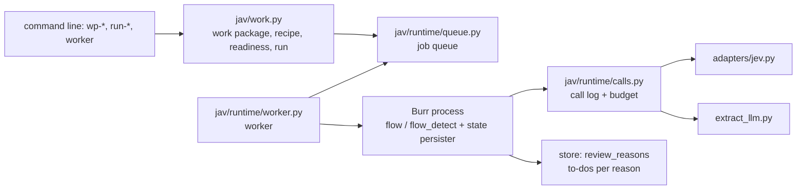
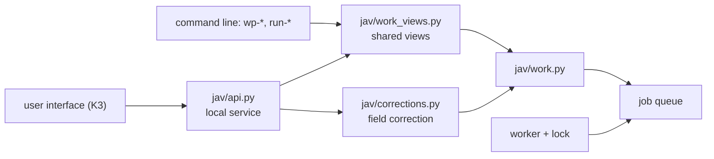
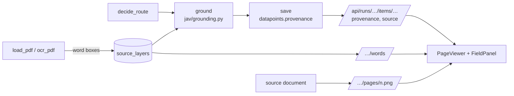

# Architecture — the end-to-end process and the five planes

**Date:** 2026-09-27 (header), reviewed 2026-09-30 (071, documentation completeness; 073, English version) · **Status:** describes the structure that actually works. The planned target structure is in sections 3–6 of the 040 plan (`plans/040/PLAN.md`, local, not in the repository): work package, run, to-do, report; six guarantees. Each dated paragraph records the findings of its own round. K1 (2026-09-27) settled the 038 guarantee boundaries for the path that runs through the worker; the old command-line measurement paths behave as before (section 6).

**039, 2026-09-22 — planned restructuring:** target architecture and migration (`plans/039/PLAN.md`, local, not in the repository). The `jav/` package stays, with sub-packages by responsibility: shared runtime/provider/storage; document, email, review and output modules; a thin CLI/API and a new UI. The old DB/facade does not become a runtime dependency of the new framework. These were planned elements. Since then (040–071) the execution layer, the local service and the React UI have been built (sections 6–8); `jav/` has been split into sub-packages only in part (`jav/runtime/`, `jav/adapters/`).

**038, 2026-09-22 — the limits of today's guarantees:** the fresh-UUID Burr applications and trackers of the basic `flow`, `flow_detect` and `flow_email` are not the same as the durable resumption of the experimental runners. A failed call of the normal `extract_llm` is not logged consistently; `TrialBudget` reserves an up-front call count and stops in dollars at the cost already booked, instead of reserving the maximum cost of the next request. Further reproduced gaps: intake path/input/dedup, closing reviews with several reasons, and the coverage signal for partial OCR. When local OCR is weak, a configured Azure DI escalation can also be used, so the data path is not only OpenAI/JEV. Full assessment and planned consolidation: `FRAMEWORK_ASSESSMENT_2026-09-22.md` (local, not in the repository). No runtime or config changed in this assessment.

**037, 2026-09-22:** `configs/capability_catalog.json` links the type and intent registries, the eight invoice packs and 15 legacy packs. `jav/capability_catalog.py` builds a deterministic catalogue without any calls, using the existing loaders, with the effective schema, nested field paths, the recognition description, status and source hashes. The existence of a pack is not automatic evidence for routing. The new config also appears in the usual `cfg` version/hash report. Details: `CAPABILITY_CATALOG_2026-09-22.md` (local, not in the repository).

**036, 2026-09-22:** `jav/legacy_packs.py` produces strict Pydantic schemas for the hash-checked legacy packs; `jav/legacy_validation.py` is an unchanged port of the old validator. `jav/legacy_runtime.py` is a service on top of the existing `flow_learning` graph (GPT extract → code validation + JEV field support → save), with its own SQLite/Burr state and response log. `jav/provider_generation.py` saves the typed GPT output before the usage data is processed. The five registered contracts are unchanged; the 15 new packs are still an experiment with explicit type selection. The separate `expansion_trial` email trial uses a durable response record, not an email Burr graph. Results and technical limits: `EXPANSION_2026-09-22.md` (local, not in the repository).

**Addendum, handoff 035:** `jav/matter_review.py` is an isolated Burr experiment: GPT decision → independent native Pydantic AI/JEV decision → comparison in code. It has its own SQLite work lock, an immutable identity, a pre-call marker and a saved response; it does not repeat an interrupted call, and reads back the final state without depending on a provider. It only produces candidates and writes no production case link. The number of registered contracts is still five; porting the search and the human decision UI is still open. The minimal GPT control reuses earlier JEV responses and does not attribute a new call or cost to them. Measured result and gaps: `LEGACY_CAPABILITIES_AND_JEV_2026-09-22.md` (local, not in the repository).

**Addendum, handoff 034:** the experimental `stack_trial.run_trial` also runs the G path of the existing invoice graph, with a separate generator identity and an `extract_llm.use_agent_factory` dependency limited to the round. `gpt_jev_comparison` stops after GPT, records the baseline without JEV, then continues from the same point along the original verification branch. This is not a new graph. `claim_assessment.review_proposal` also keeps separate optional role/state support signals alongside the aggregated answer; the 1.1.0 experimental question set is in a separate config. Measured capability and limits: `STACK_COMPARISON_2026-09-22.md` (local, not in the repository).

**Addendum, handoff 032:** `jav/claim_assessment.py` provides a separately callable claim assessment for document and email sources: exact source bundle → OpenAI interpretation → standalone JEV role/state → JEV proposal check → unchanged candidate record. Its own response log and SQLite reservation follow the pattern of the existing learning runner; it is a standalone file-based experiment, not a sixth Burr graph. Every result is `candidate_only`, `correctness=not_established`, and needs manual review. The claim identifier is not business entity resolution. Trial: `CLAIM_ASSESSMENT_PLAN_2026-09-21.md` (local, not in the repository).

**Guidance on tool use, 2026-09-21, amended in handoff 031:** OpenAI and JEV are both permitted, for email tasks as well. The framework can build on the capabilities of both, with a division of labour measured per task. The description of the existing graphs below neither restricts OpenAI to generating extracts nor makes JEV the only tool for every interpretive decision. Source checking, separate accounting and manual activation remain; the latest permission: `handoffs/031-2026-09-21-handoff.md` (local, not in the repository).

**Addendum, handoff 031:** a fifth, opt-in `email_learning` Burr graph (`jav/flow_email_learning.py`): baseline answer → source scan → source-based intent → candidate save. `jav/source_evidence.py` produces automatic source candidates with their original positions from the shared lossless chunker; it handles scanning and selection separately. An injection signal measured over the full chunk scan must not be lost in the final excerpt selection. Its own response log and resumption: `jav/email_learning_runtime.py`; manual view/label/export: `jav/email_review.py`. Candidates are not activated and are not called a golden set. Production M3 and its thresholds are unchanged; measurement: `EMAIL_LEARNING_2026-09-21.md` (local, not in the repository), [contract](flows/email_learning/FLOW.md).

**Addendum, handoff 030:** the experimental `jav/evidence_learning.py` puts an excerpt bundle of at most 8000 characters, traceable to the original source positions, in front of the same `document_learning` Burr graph. Source excerpts are chosen explicitly, not by automatic search; a marker or a skipped part is not a source quotation. The general verifier gained an optional field-format gate and a unique exact-context expansion that is off by default. The local record, the support valid for the selected context and the unestablished correctness of the document are kept separate. Live trial and limits: `LONG_DOCUMENT_TRIAL_2026-09-21.md` (local, not in the repository). No production graph, threshold or type set changed.

**Addendum, handoff 027:** alongside the three existing business graphs, a new experimental `document_learning` graph runs (`jav/flow_learning.py`, `jav/learning_runtime.py`): explicit generating model or imported proposal → JEV → unchanged record. It uses JSON state, durable SQLite Burr persistence, its own external-response log and an exclusive reservation per working directory. The three old graphs did not change; the new graph is not yet wired into the full type-recognition/intake path. [Contract](flows/document_learning/FLOW.md), measurement and limits: `LEARNING_FLOW_TRIAL_2026-09-21.md` (local, not in the repository).

**Owner's clarification, 2026-09-21, handoff 022:** the original main goal is to measure the efficiency and reliability of a general AI-flow framework and of the JEV–Pydantic AI–Burr combination. Teachable document processing is a complementary goal; the two directions advance together. The shared source- and structure-checking capabilities serve both.

**Goal extension, 2026-09-21:** for a known type, a versioned processing recipe; for an unknown one, general data-point proposals and source checking. The detailed plan (`DOCUMENT_LEARNING_2026-09-21.md`, local, not in the repository) separates the target state from the experimental JEV source finder that already exists; the existing graphs below do not yet implement this full path.

A hand-written description (extended since 2026-09-20). The generated parts: the graphs' `docs/flows/<flow>/FLOW.md` (in the repository), and the JEV call-site catalogue and the state snapshot (local, generated: `python -m jav.cli docs`, `admin --write`).
Plan and goals: the roadmap (`ROADMAP.md`, local, not in the repository); measured results: the reports (`reports/`, local, not in the repository); rules:
`CLAUDE.md`; to-dos and decisions: the backlog and the decisions log (`BACKLOG.md`, `DECISIONS.md`, local, not in the repository);
JEV capabilities: `docs/JEV_PLAYBOOK.md`; security: `docs/SECURITY.md`; config files: `docs/guides/CONFIGS.md`.

**What this is (goal as of 2026-09-20):** a general, multilingual document- and email-processing **AI-flow framework**
(Burr + Pydantic + sidecar + JEV) in which the flows are instances and the framework layer (adapter, registry schema,
call-site schema, policy schema, eval, store, contract, input adapters) is shared. The process below shows the three
reference flows (M1 document type recognition, M2 Hungarian invoice with two paths, M3 email intent); a new flow sits on the same
planes (`ROADMAP.md` §10, local, not in the repository).

## 1. The process from an email to a decision

```
 Settings → Mailboxes: download now, or a schedule (section 11)
        │
        ▼
 worker: jav/mailbox.py fetch (starts the temporary receiver below)
        │
        ▼
 scripts/mail_bridge_call.ps1
        │
        ▼
 old 10_AIFLOW_V4/scripts/outlook_bridge.ps1 (unchanged; reads desktop Outlook, read-only; -RepoRoot inbox/.bridge)
        │
        ├─► attachment files: inbox/.bridge/data/inbox/email/<acct>/<eid>/
        │
        │ POST /ingest/email
        ▼
 jav/ingest_server.py: temporary receiver on a free port, one-time key (the bridge protocol)
        │
        ▼
 inbox/<mailbox>/<msgid>/message.json (points to the attachment files)
        │
        ▼
 work package with the email-intent recipe (a person starts the paid run; the worker runs it)
        │
        ▼
 M3 email_intent graph (jav/flow_email.py)
 load_message → classify_attachments → intent → route → tasks → save
                         │                        │              │
                         │                        │              └─► store.emails + email_results + review_queue
                         │                        ▼
                         │            policy.email_next_flow (code) ──► m2:<type> · m1:detect · human:* · archive*
                         ▼
 M1 graph for each PDF (jav/flow_detect.py)
 load_pdf [→ ocr_pdf] → detect → save ──► store.documents
                        JEV: doc_type + issuer_hu + language (+ the detailed type since 047)

 folder corpus (913 PDFs) ──► detect-corpus ──► M1 graph per document ──► store.documents (type × year report)

 store.documents (a type with a type pack; since 047 the detailed type) ──► M2 invoice graph (jav/flow.py; the type pack
 configs/types/<type>.json supplies the fields, questions, prompt and validators), two paths in one graph:
     load_pdf [→ ocr_pdf], then
     S: find_candidates (code) → jev_select (JEV Choice, 3 batched requests) → normalize_picks
     G: extract_llm (gpt, Pydantic AI) → jev_verify (code evidence + JEV Noul fan-out) → normalize_llm
     both → validate (code) → decide_route (policy) → ground (code, 045) → save → done | needs_review
```

Since 058 (K5.2) each PDF attachment is also an item of the email's work package and gets the full document processing
(M1 + M2, section 10). The email input can still be driven by hand: an old bridge started without `-RepoRoot` posts to
`python -m jav.cli email-ingest-server` and keeps its attachments under the legacy project's `data/inbox/email/<acct>/<eid>/`;
the receiver resolves both attachment roots (`jav/ingest_server.py` `host_path`), and `email-inbox inbox/` then runs M3.

The **golden loop** is the same for every flow: golden set (referenced from the legacy project; the PII stays there) → run
with the cache ($0 thanks to the request hash) → report (`runs/*.jsonl` + Markdown) → discrepancy analysis from the raw
run → general rule (config change with a version bump) → rerun → determinism measurement without the cache. From live
data: a manual labelling list (`*_manual_sample.md`) → our own golden set (`golden_labels`); manual labelling is
currently postponed.

## 2. The five planes

| Plane | What | Where | Control |
|---|---|---|---|
| **Flow** (Burr) | five graphs: the three reference flows and the two learning branches; `@action.pydantic` typed state, `run_id` = app_id, local tracker | `jav/flow.py`, `flow_detect.py`, `flow_email.py`, `flow_learning.py`, `flow_email_learning.py`; a `CONTRACT` at the end of each | `python -m jav.cli flows` lint + FLOW.md; tracker UI `burr` |
| **Decision** (JEV + GPT) | the families of JEV call sites: detect and detect_detail, email_intent, select (Hungarian, foreign, utility), verify (per type) — one file each under `configs/callsites/`; two generative steps: the G path's extractor (extract_llm) and the email task proposals (`configs/email_tasks.json`); the adapter (`jav/adapters/jev.py`) puts the concrete model version into the cache key, calls with a RetryPolicy and passes SDK errors on as `JevUnavailableError` | question sets `configs/callsites/*.json`, registries `configs/doc_types.json`, `intents.json`; code: `jav/detect.py`, `intent.py`, `jev_select.py`, `jev_verify.py`, `extract_llm.py` | `configs` (version, hash), the `docs/callsites/` catalogue (local, generated, not in the repository), bands and routes in `configs/policy.json` (`bands` / `band_for`, `jav/policy.py`) |
| **Data** (SQLite) | documents · datapoints · emails · review_queue · ledger · golden_labels; since 040 also the tables for work packages, runs, the job queue, to-do reasons, the call log, email results, mailboxes and watched folders (full list: the `CREATE TABLE` statements in `jav/store.py`, `jav/work.py`, `jav/runtime/queue.py`, `jav/runtime/calls.py`, `jav/mailbox.py`, `jav/app_settings.py`, `jav/corrections.py`, `jav/source_layer.py` and `jav/legacy_import.py`); the process state lives in a separate store (`store/burr_state.sqlite`) | `store/jav.sqlite`, `jav/store.py` (additive migration) | `store` statistics (row counts of the core tables); the ledger records every AI call with its `config_hash` and, on failure, an `error` |
| **Measurement** (eval) | flow-independent list of judgements from the raw runs: accuracy and band per question, calibration (ECE), top-prob vs. conf, policy re-evaluation without calls, determinism | `jav/eval_report.py` (input `runs/*.jsonl`), the flow-specific runners `jav/evals*.py` | `eval-report` → `runs/<time>_eval_report.md`; golden / determinism commands per flow |
| **Administration** | config versions and hashes, models and prices, lint, golden results, review queue; session rules and hooks | `jav/cfg.py`, `configs/models.json`, `jav/admin.py`, `CLAUDE.md`, `.claude/settings.json`, `scripts/hooks/` | `admin` on one screen; hooks: handoff loading, compact warning, Stop reminder (non-blocking since 2026-09-27), handoff review (Fable) |

## 3. Where each decision is made — the decision hierarchy in practice

1. **Code** (deterministic, tested): candidate finders, validators, body cleaning, anchor features, evidence matching,
   `next_flow`, the review latch. This is the mechanism.
2. **JEV** (judgement over a finite set of options): one of the tools for selection, presence and verification steps. One call site = one JSON config
   + one `build_state` + one `build_questions` + one `jev.ask(...)` through the adapter. Raw probability goes into the state,
   thresholds only into `policy.json`: a named band set per call site (`band_for`), Noul no / uncertain / yes,
   Choice auto / uncertain / human (confidence threshold + gap to the second option); the `uncertain` band triggers review only
   with `uncertain_review: true`. Because of the request-hash cache, the same (concrete model version, state, questions) gives the same answer
   for $0; the alias (`jev-latest`) is resolved with a probe (`runs/cache/_model_versions.json`, 24 h TTL). If JEV still
   does not answer after the SDK retries, the adapter writes a ledger entry (`error`) and raises `JevUnavailableError`; the flows turn this
   into a `jev_unavailable:<reason>` review (M1/M3 `final_status = jev_unavailable`) instead of crashing.
3. **OpenAI, through Pydantic AI**: the existing G path and the document-learning branch produce structured proposals and then apply source checking. Further interpreting, classifying and verifying roles are also permitted; any new division of labour must be built in on the basis of targeted measurement. The Burr states are plain Pydantic models, not Pydantic AI.
4. **OCR pipeline (2026-09-20, first half of B5)**: `jav/ocr.py` + `configs/ocr.json` — PDF without text → page image (pypdfium2,
   300 dpi) → tesseract word boxes (native tesseract on the machine; the Hungarian + English language packs taken from the old sidecar's Docker image
   into `tools/tessdata`; fallback: the old sidecar image via `docker run`) → the same line/cell builder as for the text layer
   (`jav/pdf.py: build_layout`). A separate graph step (`ocr_pdf`) in the M1 and M2 graphs, a disk cache in `runs/ocr/`,
   raw quality signals in the state, thresholds in the `ocr` block of `policy.json`. The rest of the old sidecar (torch, the matcher)
   has not been ported; Azure DI is not reimplemented here either: when local OCR is weak, `ocr_with_escalation` reaches it through the
   old sidecar (paid). Heavy dependencies may only go behind a sidecar.

## 4. Tuning and changes — the procedure

| Change | Where | What follows |
|---|---|---|
| type or intent description (`what`), boundary (`not_for`), example (`examples`), family (`parent`) | `configs/doc_types.json` / `intents.json` (schema v2), bump `meta.version` + changelog | `detect-golden` / `email-golden` (new hash → live calls), `detect-determinism` / `email-determinism`; `eval-report` (parent-label section); regenerate `docs` |
| JEV instruction, Noul question | `configs/callsites/<callsite>.json` | the same; the local, generated call-site catalogue shows the statistics per version |
| band, threshold, route | `configs/policy.json` (`bands`, `band_for`, routes) | no rerun needed: `eval-report` shows from the raw runs (`runs/*.jsonl`) how many cases would change band |
| model, price, timeout, retry, cache version, alias TTL | `configs/models.json` | bumping `cache_version` invalidates every cache key; a model-version change (detected by the probe) produces a new key by itself |
| graph step | flow module + `CONTRACT` | `flows` lint + FLOW.md |
| code (regex, cleaner, validator) | `jav/*.py` + test (TDD) | `pytest`, `recall`, golden |

Pitfalls: a `use_cache=False` run **updates** the cache file (it refreshes the reference), except for the determinism measurement,
which runs under `JevAdapter.no_cache_write()` (since 2026-09-20): no reads and no writes, so the reference answer stays untouched.
The old inbox folders contain attachments only; any change to a Choice criterion means a new cache key. Since 2026-09-20 the cache
key contains the concrete model version (`cache_version` went to 2 at the same time): even a fully cached golden run
needs one probe a day (an API key is required; offline, the resolution stored in the file is used, with a warning).

## 5. What Claude needs to know to develop efficiently

- Session protocol and handoff: `CLAUDE.md` §2; the hooks back it up (SessionStart / PreCompact / Stop / handoff review).
  Session start: `python -m jav.cli preflight` (pytest + UI checks + contract lint + configs + handoff freshness + git
  state + data guard + language guard + Ruff ratchet + the local state snapshot), then the full handoff (the hook loads it),
  the backlog and the decisions log (`BACKLOG.md`, `DECISIONS.md`, local, not in the repository). Never copy state numbers
  anywhere by hand: refer to the generated state snapshot. Handoffs follow the template (`handoffs/TEMPLATE.md`, local, not
  in the repository).
- Designing a JEV question: `docs/JEV_PLAYBOOK.md` (facts from the docs, gap analysis per call site, checklist).
- A new JEV question: config JSON + `build_questions` (registry reference `registry:<name>`), the `docs.typesafe.ai` cookbook, a test
  modelled on `tests/test_cfg.py`, a golden run before and after.
- A new flow: module + `CONTRACT` + `TERMINALS` + `build_app` (tracker project in `models.json`) + lint + a golden runner
  modelled on `evals_*.py`; a flow never imports an SDK, only the adapter.
- Search the legacy project first (`CLAUDE.md` §3), and state the decision in the handoff.

## 6. Execution layer: work package → run → worker (040 K1, 2026-09-27)

**Plain-language summary.** Documents go into a work package, the package gets a recipe, and the run goes through a
durable job queue in the background. Before every paid call, an entry is written and the cost is reserved. After a stop,
the run resumes from the saved step, and a call that has already been paid for is not repeated. To-dos can be resolved
reason by reason, and a live run can only be approved when it has no open to-dos.



| Layer | File | Guarantee | Test |
|---|---|---|---|
| Work package, recipe, run | `jav/work.py`, `configs/recipes.json` | version conflict → `RevisionConflict`; readiness blockers; fixed input; idempotent start; approval only in live mode and with no open to-dos | `tests/test_work.py` |
| Job queue | `jav/runtime/queue.py` | dedup key, claiming, attempts + back-off → `dead`, release, stop, handling of orphaned claims at start-up (modelled on the V4 `jobq.py`) | `tests/test_runtime_queue.py` |
| Call log, budget | `jav/runtime/calls.py` | reservation before the network call; failed calls are logged too; an unknown cost stays reserved; an uncertain attempt is not repeated; a successful step is replayed | `tests/test_runtime_calls.py`, `tests/test_runtime_adapters.py` |
| Worker | `jav/runtime/worker.py` | stable identifier + Burr state persistence (`burr_state.sqlite` next to the store); resumption from the next step; stop at a step boundary; a changed source is rejected | `tests/test_runtime_worker.py`, `tests/test_work_cli.py` |
| To-dos | `jav/store.py` `review_reasons` | each reason is opened and closed by the step that raised it; human decisions carry an author | `tests/test_review_reasons.py` |
| Partial OCR | `jav/policy.py` `ocr_coverage_reasons` | a skipped page is always a to-do | `tests/test_ocr_coverage.py` |
| Email receiver | `jav/ingest_server.py`, `jav/emails.py` | paths stay inside the root, size and structure limits, mandatory key (since 066; without one it prints a one-time key at start-up), requests from a browser are rejected, replay protection by content hash | `tests/test_ingest_security.py` |
| Operational safety net (063) | `jav/runtime/worker.py`, `jav/runtime/queue.py`, `jav/mailbox.py`, `jav/app_settings.py`, `jav/work.py` | the worker loop does not stop on an unexpected error (the job is closed and the error logged); an orphaned job is restarted at most 3 times and then marked dead; a stop requested while the worker was down is completed at start-up; an interrupted run start is completed on retry and is not "done" until then; emails that arrived before a download was interrupted still go into a package; a watched folder marks a file as seen only after it has been added successfully, and only one process scans a folder at a time; PDFium calls run under a lock | `tests/test_stability_063.py` |
| Log, backup (063) | `jav/runtime/applog.py`, `jav/backup.py` | permanent, rotating log (`runs/logs/`); store backup even while runs are in progress, with an integrity check (`python -m jav.cli backup`) | `tests/test_stability_063.py` |
| Daily backup, store thinning (064) | `jav/backup.py`, `jav/runtime/persistence.py`, `jav/runtime/worker.py`, `scripts/backup-task.ps1`, `configs/service.json` `backup` | scheduled daily backup, verified copy to a second location, status file and UI warning; of a closed item's process states only the last one is kept (Burr `load` also reads only that one); `burr-prune` for a one-off thinning and compaction of the old store | `tests/test_ops_064.py`, `ui/src/ops064.test.tsx` |

**Limits.** The call log and the budget only apply on the path that runs through the worker (`calls.use_run`). The old
command-line measurements (`golden`, `determinism`, `run` …) make their calls as before, so that closed measurements
stay comparable; only the GPT error logging improved there. Only one worker can run at a time (guarded by a lock since
K2, see section 7). The email process has been a recipe since 048 (email intent, section 11), and since K5 (058) it
includes the attachments. The old experimental `TrialBudget` is unchanged, because the closed experiments rely on it.
Failure probes on the fixed code: `runs/20260927_k1_audit/probes.json`.

## 7. Local service (040 K2, 2026-09-27)

**Plain-language summary.** The user interface and the command line use the same gateway: a service that can only be
reached from the local machine. It does not run anything itself; it only queues work and reads from the store. The
separate worker does the processing, so closing the browser or the service does not stop a run. A request that comes
from another machine or a web page, is too large, is not JSON or contains unknown fields never reaches the business
operation. Since 061 documents can be added from any existing local folder; a setting can restrict this to permitted
folders. Field corrections are versioned: a save based on an outdated version is rejected.



| Layer | File | Guarantee | Test |
|---|---|---|---|
| Gateway | `jav/api.py`, `configs/service.json` | loopback address only; `Host` and `Origin` checks; write requests must be JSON; body size limit, also for chunked transfer; Pydantic schemas that reject unknown fields; identifier patterns; folders and files: an existing path (links resolved), anywhere since 061 — with the `restrict_paths: true` setting, only under a permitted root | `tests/test_api.py` |
| Browser security headers (071) | `jav/api.py` (`_SecurityHeaders`, the outermost layer) | on every response, including the gateway's rejections: framing forbidden (`X-Frame-Options: DENY`, `frame-ancestors 'none'`), `nosniff`, `Referrer-Policy: no-referrer`, COOP/CORP `same-origin`; on the UI's HTML a content security policy that allows only the app's own origin (`data:` for the embedded font and the favicon, `blob:` for downloads); `/api/` responses are `no-store` (page images included), with a locked-down policy; on the source PDF the policy only forbids framing (because of the browser's PDF viewer) | `tests/test_security_headers_071.py` |
| Version (071) | `jav/version.py`, `pyproject.toml` | a single version source; `/api/health` returns the version and the commit recorded at start-up (`dirty`: uncommitted changes); the **System** (*Rendszer*) page shows it | `tests/test_version_071.py`, `ui/src/version071.test.tsx` |
| Shared views | `jav/work_views.py` | the command line's `--json` output and the service's response are identical; money as text, not floating point | `tests/test_api.py::test_cli_and_service_give_the_same_answer` |
| Field correction | `jav/corrections.py` | version + 409 on conflict; only fields of the type pack; money and dates checked in code; forbidden on an approved run; the machine data is kept | `tests/test_api.py::test_correction_is_versioned_and_conflict_is_refused` |
| Worker lock, stop | `jav/runtime/lock.py`, `jav/runtime/worker.py` | operating-system lock (released automatically on a crash); a stop request takes effect after the item in progress | `tests/test_api.py` |
| Start-up | `scripts/dev.ps1 start/status/stop` | service + one worker in the background, logs under `runs/dev/` | manual test (2026-09-27) |

**Error codes:** 404 unknown identifier · 409 version conflict, cannot be started or cannot be approved · 413 body too large ·
415 not JSON · 422 invalid input or missing author · 403 another machine, foreign origin or forbidden folder. Human
operations require the `X-Actor` header: decisions (approval, correction, closing a to-do) and, since 061/066, also creating
and changing a package, the recipe, and starting or stopping a run or the worker. The machine-readable list of endpoints
on a running service: `/api/openapi.json` (the clickable `/api/docs` has been switched off since 071 because it would load
program code from an external host).

**Limits.** There is no login and no permission system (a single-user local tool, 040/7). We follow the V4 endpoint names
(`workflow`, `readiness`, `start`, `runs`); the work package resource is called `workpackages` instead of the V4 `intake-batches`. The report
endpoint returns the run's per-item result (machine data, correction, merged value); the export and the utility-cost report were built
in K4 (054) (section 10, Reports row).

## 8. User interface (040 K3, 2026-09-27)

**Plain-language summary.** The browser UI opens at the local service's address (`http://127.0.0.1:8930/`), with no
separate server. Its first version had three menu items (**Work packages** (*Munkacsomagok*), **Run** (*Futtatás*),
Reports (*Riportok*)); since 057 the main menu is **Work packages** + **Settings** (*Beállítások*) (section 10, UI structure row).
The UI contains no business rules. The service makes every decision (version, readiness, approval); the UI only displays
and forwards. Corrections are made next to the source document and are not lost when a save fails.

| Part | File | What it does | Behavioural guarantee (test) |
|---|---|---|---|
| App shell | `ui/src/App.tsx`, `ui/src/styles.css` | sidebar (two menu items since 057), worker status, **Who is working?** (*Ki dolgozik?*) (061: with a non-empty name list, choosing from the list is mandatory; a **My work today** (*Mai munkám*) link) | `ui/src/users.test.tsx` |
| Routing | `ui/src/route.ts`, `ui/src/hooks.ts` | the selected package, run and item are in the URL (bookmarkable) | a package that has disappeared is not replaced by another one; an old response does not overwrite a newer one |
| Work packages | `ui/src/views/Workpackages.tsx`, `WorkpackageDetail.tsx` | list, creation from a folder or from files, **Items** (*Tételek*), Processing (recipe, readiness, trial or live start) | on a version conflict the view reloads and the settings are kept |
| To-dos | `ui/src/views/ReviewWorkspace.tsx`, `ui/src/review/FieldPanel.tsx` (since 045; the earlier correction editor has been retired) | item list, source PDF, own and earlier to-dos, resolution per reason, field correction | the working copy survives network errors and conflicts |
| Run | `ui/src/views/Runs.tsx` | list, detail view with live updates during a run, budget bar, job queue, call log expanded, stop, approval | – |

**Technology.** React 19, Vite 8, TypeScript 5.9; tests: Vitest 4 + Testing Library (jsdom). 137 npm packages in total (2026-09-30),
no component library. The font (Geist) comes from a local package, so no internet access is needed. The build goes into `ui/dist/`
(git-ignored), and the service serves it at the root. The browser always re-requests the entry HTML. For development,
`npm run dev` (port 5173) forwards `/api` calls to the service. Preflight runs the UI's type check and tests if
`ui/node_modules` is installed.

**Limits.** The **Who is working?** name is not a login (there is no password) but the active user: since 061, with a non-empty name list, the service accepts only a name on the list for human operations. The Hungarian
field names are in a shared label configuration (since 056); on 2026-09-29 every field of all 23 type packs had a Hungarian name. Section 9
(045) describes how the source is displayed; the browser's PDF viewer has been retired.

## 9. Source-grounded review (045 K3b, 2026-09-28)

**Plain-language summary.** When a run reads the text, it also saves where each word is (the word layer), and for every
extracted field it computes where the field is on the document (the source location). The review UI draws a box around
the selected field on the document's page image. It also shows the other candidates, and a field can be filled from words
selected on the image. All of this happens in code, without AI calls. If the location is ambiguous, there is no box,
only an explanation: no box is better than a wrong box.



| Part | File | What it does | Test |
|---|---|---|---|
| Word layer | `jav/source_layer.py`, `jav/pdf.py`, `jav/ocr.py` | page-relative boxes from the reader's set of words (text layer, local OCR, Azure), with a content-based identifier; the lines and the JEV requests are unchanged | `tests/test_source_layer.py` |
| Source location | `jav/grounding.py`, `configs/grounding.json` | S path: the selected candidate in its own line (text wrapped onto the following lines is followed in the same column, 046) + the other candidates with their probabilities; if it cannot be found anywhere, an approximate box on the chosen line (`approximate`, 046); search: comparison by kind, label context (V4 dictionary), part of a larger number excluded, two-line names in columns; several positions → no box, the positions become alternatives | `tests/test_grounding.py` |
| Process step | `jav/flow.py` `ground` | `decide_route → ground → save`; on an error the run continues without a source location | contract lint, `test_flow_run_saves_provenance` |
| Correction with a location | `jav/corrections.py` | selected words (`sources`) with a version; the valid location: manual > search for the corrected value > machine; the old box of a corrected field is only an alternative | `tests/test_api.py` |
| Endpoints | `jav/api.py`, `jav/page_image.py` | page image (PNG, 72–200 dpi, hash-protected), word layer, normalisation, settings | `tests/test_api.py` |
| UI | `ui/src/review/` | page image, box in the band's colour, clicking on the image, alternatives, selection (word, rectangle), working-copy store, splitter, keyboard shortcuts | `ui/src/behaviour.test.tsx` |

**Measurement (no calls).** 21 golden-set documents with a text layer, search only (the method used on the G path and for manual correction): of 269 values, 154
got a box, 61 had several possible positions and 49 were not found (mainly addresses and country names that appear in a different form in the golden set). The 5 invoices
of the live trial, rerun from the cache (S path, 0 paid calls): of 82 filled fields, 71 got a box and 13 alternatives. After 046 (`run-04fca1b36fbb`, 0 paid calls): 77 exact boxes + 1 approximate, and the only field to review (the IBAN wrapped onto two lines) also gets an exact box; evidence: `runs/20260928_k3b_grounding/replay_046.json`.
Evidence: `runs/20260928_k3b_grounding/`.

**Limits.** Old runs and documents read from the old OCR cache have no word layer (owner's decision:
the layer is built during the run). Line-item positions on the image have existed since 053 (section 10, Boxes and line-item positions row). A correct box does not mean accuracy: the
box shows where the value comes from, not that the value is correct.

## 10. Unified document types (047 T1, 2026-09-28)

**Plain-language summary.** All 23 document types of the legacy project are complete type packs. After the broad category,
recognition picks the detailed type, extraction runs with that type's pack, and old results can be imported for
comparison. Measurement: the T1 report (`reports/2026-09-28-t1-tipusegyesites.md`, local, not in the repository).

| Element | File | What it does |
|---|---|---|
| Pack format | `jav/typepack.py`, `jav/models.py` | `list` field with an item description (`list_fields`), `boolean`, enumerated values (`enums`; a violation is a to-do); `arms`, `parent`, `auto_detect`, `detect` (old keywords) |
| Converter | `jav/typepack_convert.py` | old type copy (`configs/legacy_types/`) → pack + G-path verification call site; schema and prompt verbatim, provenance with the manifest's sha256 hashes |
| Statement rules | `jav/validators.py` → `jav/legacy_validation.py` | running balance, closing balance, totals, period — as record checks |
| Detailed type | `jav/detect_detail.py`, `configs/callsites/detect_detail.json`, `policy.json detect_detail` | one candidate → that one; the old anchor score at the start of the document (V4 `anchor_check`), code decides when the lead is clear; otherwise JEV Choice with `none`; a type left open = to-do |
| Recipe | `configs/recipes.json` `document-processing`, `jav/runtime/worker.py` | steps: recognition → extraction with the detailed type's pack; the path is the one requested, if the pack supports it |
| Invoice line items (053 T3) | `configs/types/{invoice_hu,*_szamla}.json`, `jav/validators.py`, `jav/policy.py` | `line_items` list with the item fields of the GPT schema; `line_items_total` (sum of the items = invoice total; it is enough if one side, net or gross, is complete) and `line_items_arithmetic` (arithmetic per line; not on MOHU invoices); `"review": false` = flag only (`CheckResult.advisory`; the to-do rule skips it); `default_arm` + recipe `arm=auto` (utilities: G) |
| Boxes and line-item positions (053) | `jav/grounding.py` (`locate_value`, `locate_rows`, `ground_lists`), `jav/reground.py`, CLI `reground`, `ui/src/review/PageViewer.tsx` | a value that appears in several places: box at the most probable position (`multiple`, alternatives); currency signs ("Ft"); table columns are not merged into one number; the list's rows in `provenance[<list>].rows`; recomputing an existing run (the position chosen during the run is kept); on the image every box is drawn faintly and the selected one strongly |
| Reports (054 K4) | `jav/export.py`, `jav/report_utility.py`, `configs/reports.json`, API `/runs/{id}/export`, `/runs/{id}/reports/utility-cost`, `ui/src/views/UtilityReport.tsx` (since 057 in the package's **Result** (*Eredmény*) stage) | export from the run's valid data (`run_records`: machine + correction, valid source location, open to-dos); CSV with `;` + BOM + formula protection, XLSX text is never a formula; utility grid: daily pro-rating with Decimal, duplicate (type + invoice number) and settlement invoices, the water summary is informational only; the old `tabular.py` and `csv.ts` helpers ported |
| Unified data view (056 U1) | `jav/tablequery.py`, `jav/datasets.py`, `configs/datasets.json`, `configs/field_labels.json`, API `GET /datasets`, `POST /datasets/{name}/query`, `POST /datasets/{name}/export`, `ui/src/components/` (DataTable, Picker, DatasetPicker, DownloadPanel, Popover), `ui/src/views/ResultStage.tsx` (since 057 the package's Result stage instead of the separate data browser) | 15 datasets (11 at 056) with column descriptions; search (accent-insensitive), column filters, Hungarian collation (ö/ő and ü/ű as separate letters; in a mixed text column, pure numbers sort as numbers), paging in the service (decision 2026-09-28); the run's data (`datasets.run_records`) is cached per fingerprint and shared by the tables, the utility report and the full export; download of all / filtered / selected rows with chosen columns (using the CSV and XLSX writers of `jav/export.py`); UI: TanStack Table 8 + Virtual (above 80 rows only the visible rows are rendered) |
| UI structure (057) | `ui/src/App.tsx`, `ui/src/route.ts`, `ui/src/views/WorkpackageDetail.tsx` (+ `ProcessStage`, `ResultStage`, `DocumentsPanel`), `ui/src/views/Settings.tsx` (+ `settings/`), `jav/work_views.py` `next_step`, `jav/work.py` `start_run(rerun_of=)` | main menu: Work packages + Settings; package stages process / review / result (**Processing** (*Feldolgozás*) / **Review** (*Ellenőrzés*) / **Result**), old URLs redirected; the next step is computed in the service, as a code + parameters, and the UI translates it |
| Settings (057) | `jav/app_settings.py`, API `/settings/users`, `/settings/folders`, `/settings/folders/{id}/scan`, `app_settings.tick()` in the worker loop | user name list (local store); watched work folders the V4 way (one shared / daily package, recipe, frequency), any existing folder (061; with the restriction on, only under a permitted root), read-only, a file already seen (path + size + mtime) is not hashed again, a removed document does not come back, no run starts by itself |
| Users and assignment (061) | `jav/app_settings.py` (`canonical_user`), `jav/api.py` (`human_actor` → `UnknownUser` 403 `unknown_user`; creating a package, its items, the recipe and starting a run are human operations too), `jav/work.py` (`workpackages.owner`, `set_owner`), API `/workpackages/{id}/owner`, `jav/activity.py`, `jav/datasets.py` (`workpackages` `owner` scope, `activity`), `ui/src/views/Activity.tsx`, `ui/src/hooks.ts` (`useActor`, `useEvent`) | no password; with an empty name list any name is accepted (first setup); the name is stored in the spelling used in the list; the **Assignee** (*Felelős*) is not a permission; the activity log is built from the existing rows that carry an author (package events, recipe, run start / approval, correction, closing a to-do, task decision, mailbox download); a day is the local calendar day |
| Run start with confirmation (061) | `ui/src/views/StartConfirm.tsx`, `ui/src/route.ts` (`#/workpackages/{id}/process/start?mode=…&rerun=1`) | the run buttons lead to the confirmation page; it shows a summary (mode, package, recipe with its settings, number of items, maximum cost per provider) and the only start button |
| Package management, status, fingerprint (058) | `jav/work.py` (`archive_/restore_/rename_/delete_workpackage`, `workpackage_events`, `resolve_reason`, `fingerprint` + `file_fingerprints`), API `/workpackages/{id}/archive|restore|rename|delete`, `jav/work_views.py` `result_tables`, `ui/src/views/WorkpackageActions.tsx` | hiding = `workpackages.status='archived'` (the list asks for hidden packages with the `include_archived` scope); deletion only when there are no runs, with an event log; closing a to-do updates the state of the run it belongs to; readiness and the page image use a hash remembered by size + mtime, the start and the worker a full one; the Result views come from the run's data (`tables`) |
| Emails as a second recipe (058 K5.1–K5.2) | `jav/store.py` (`email_results`), `jav/emails.py` (`body_coverage`), `jav/flow_email.py` `save`, `jav/mailbox.py` (`email_result_for`, `effective_email_result`, `add_attachments`), `jav/corrections.py` (`_save_email`), `jav/export.py` (`email_records`, `emails_table`), `jav/datasets.py` (`emails`), `jav/work.py` (`parent_item_id`, `flow_for`, `run_budget`), `configs/recipes.json` email-intent v2 | the email result is stored per run; the share of the text that was seen is computed in code; intent correction is versioned, the next step is derived in code from the corrected intent, and the intent to-do closes with the decision; a PDF attachment becomes a document of the package that points to its email, and the recipe chooses the flow (`flows`) and the budget (`max_item_usd_by_kind`) per item kind |
| Task proposals (058 K5.3) | `jav/email_tasks.py` (proposals from GPT through the call log and the budget, `gate`), `jav/flow_email.py` `tasks` step (route → tasks → save), `configs/email_tasks.json`, `jav/prompts/email_tasks_prompt.md` (the old v1.3.0 verbatim), `store.email_results.tasks` + `email_task_decisions`, `jav/mailbox.py` (`task_view`, `decide_task`), API `/runs/{id}/items/{item}/tasks/{n}/decision` and `/tasks/{n}/done` (062: manual **Done** (*Elvégezve*), `email_task_decisions.done_by` / `done_at`), `jav/datasets.py` `email_tasks` | the recipe's `tasks` parameter (off by default); no call on the archive route (code); the gate applies the old rules (verbatim quotations only from the subject / body, a YYYY-MM-DD deadline, a verbatim assignee), and an invalid proposal drops out with a reason code — since 062 together with its content, the part that failed (`failed_parts`) and a check per quotation (`quotes`); identical proposals within one email are merged (`merged`); a proposal becomes a to-do that closes after the human decisions |
| Language and appearance (057) | `ui/src/i18n/` (t, useLocale, en-*.json), `ui/scripts/check-i18n.mjs` (+ `--audit`, part of preflight), `ui/src/appearance.ts` | the V4 i18n pattern ported: Hungarian keys, and the English dictionary is loaded only when switching to English; labels that come from the service (dataset columns, enumerated values, field, type and recipe texts) must be translated too; theme (light / dark / system) and density per viewer |
| Old results | `jav/legacy_import.py`, CLI `legacy-import` / `legacy-compare` | the old batch exports are only read, by sha256, into a separate table (`legacy_results`); comparison = agreement, not accuracy |

**Line lists in the UI (048 T1 list, 2026-09-28).** Correcting a `list` field replaces the whole list, and each cell is
checked against the item field's kind and enumerated values (`jav/corrections.py` `list_columns`, `_check_list`). The item
result (`item_result`) also returns the list's columns (`lists`) and the pack's checks on the corrected data (`checks`, with `rows` for
errors that point at rows). In the UI the right panel's tabs are **Fields** (*Mezők*) / one tab per list (`ui/src/review/ListTable.tsx`); a
list tab keeps its own image-to-panel ratio. List rows have had boxes on the image since 053 (the Boxes and line-item positions row). Tests: `tests/test_list_corrections.py`,
the line-list block of `ui/src/behaviour.test.tsx`.

`documents.doc_type` is the broad category and `documents.detail_type` the detailed type; `datapoints.doc_type` is the
pack used for extraction. The old type copies remain as sources (hash-checked); the separate old runner
(`jav/legacy_runtime.py`) has not been retired yet.

## 11. Mailbox reading and scheduling (048 T2, 2026-09-28)

**Plain-language summary.** In the **Mailboxes** (*Postafiókok*) section of Settings (a separate Mailbox view before 057)
you choose which mailbox to read and for which period. First you can ask for a free preview of the message count, then
start a one-off download or a schedule (default: hourly). The worker does the download with the old Outlook script. New
emails become a work package with the email intent recipe; a person starts the paid processing. Outlook must be running
on the machine.


| Element | File | What it does | Test |
|---|---|---|---|
| Preview, download | `jav/mailbox.py` `count`, `fetch` | the old script, unchanged; its project root is `inbox/.bridge` (attachments, "already read" list), not the legacy project; all messages (`-AllEmails`); a work package from the new / changed messages | `tests/test_mailbox.py` |
| Temporary receiver | `jav/ingest_server.py` `make_server(0, token=…, on_ingest=…)` | free port, one-time key; the existing replay protection (identical content = replay) | `tests/test_mailbox.py`, `tests/test_ingest_security.py` |
| Download log, schedule | `jav/mailbox.py` (`mailbox_pulls`, `mailbox_schedules`), `jav/runtime/worker.py` | every download is a job-queue task; the worker calls `tick()` on every loop; an error goes to the log and is not retried | `tests/test_mailbox.py` |
| Email item | `jav/work.py` `add_items(kind="email")`, `review_subject`; `configs/recipes.json` `email-intent`; `jav/flow_email.py` (`run_id`, state persistence) | item = the email's `message.json`; the subject of the to-dos is the email's identifier | `tests/test_mailbox.py` |
| UI | `ui/src/views/Mailbox.tsx`, `ui/src/review/EmailReview.tsx` | form, preview, download, schedules, log; in the review workspace, the email and its intent | `ui/src/behaviour.test.tsx` |

Limitation: the download runs in the worker's thread (possibly for minutes), and document items make no progress in the
meantime. Manual intent correction and attachment processing have existed since 058 (K5.1–K5.2, section 10): a PDF
attachment runs in its email's package with the email recipe, not in a separate document work package.

## 12. Data checks, limits and safeguards (066–071, 2026-09-29/30)

**Plain-language summary.** After the 066 review and the independent audit, the system became stricter in several places.
It checks tax numbers against recognised formats and the check digit, it does not claim false certainty for a field with no
candidates, a damaged glyph no longer turns into a negative amount, and a document without a type pack gets a to-do. The
input limit stops documents that are too large. On the code side the data guard protects what goes to GitHub, on the
browser side the security headers protect the UI, and the running version is visible. The full security picture:
[security notes](SECURITY.md).

| Element | File | Guarantee | Test |
|---|---|---|---|
| Tax number (069) | `jav/taxid.py`, `jav/validators.py` `tax_id` | recognised format (Hungarian domestic, Hungarian EU VAT (*közösségi adószám*), other EU and some non-EU); the label is stripped; for Hungarian numbers the check digit, VAT code and county code are checked; anything unrecognisable is a to-do | `tests/test_taxid_069.py`, `tests/test_properties_067.py` |
| Field without candidates (069) | `jav/jev_select.py` | a "no estimate" flag and a presence question; an empty field never gets 100% | `tests/test_no_candidate_field_069.py` |
| Lost glyph (069) | `jav/pdf.py` `fix_lost_glyphs` | a damaged currency sign does not produce a hyphen (a negative amount) | `tests/test_lost_glyph_069.py` |
| Document without a type pack (069) | `jav/flow_detect.py` | a recognised type that has no pack gets a to-do | `tests/test_no_type_pack_069.py` |
| Input limit (067) | `configs/service.json` `input_limits`, `jav/pdf.py`, `jav/ocr.py`, `jav/page_image.py` | file size, page count, page-image pixels; above them a named error or a to-do | `tests/test_input_limits_067.py` |
| Data guard (071) | `jav/data_guard.py`, `scripts/githooks/`, `configs/data_guard.json` | before a commit and a push: real-looking data, keys, internal working documents, documents and binary files stop it; the old history cannot be pushed | `tests/test_data_guard_071.py` |
| Security headers (071) | `jav/api.py` `_SecurityHeaders` | see the table in section 7 | `tests/test_security_headers_071.py` |
| Version (071) | `jav/version.py` | see the table in section 7 | `tests/test_version_071.py` |
