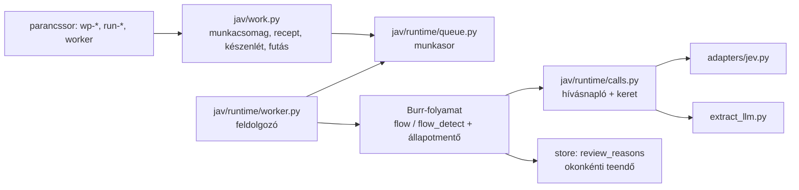
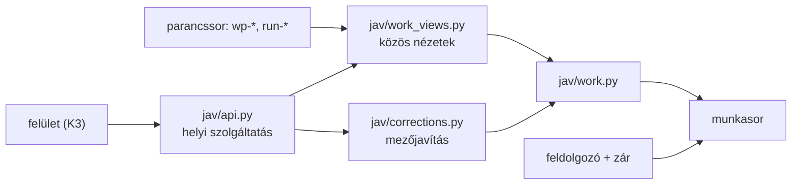
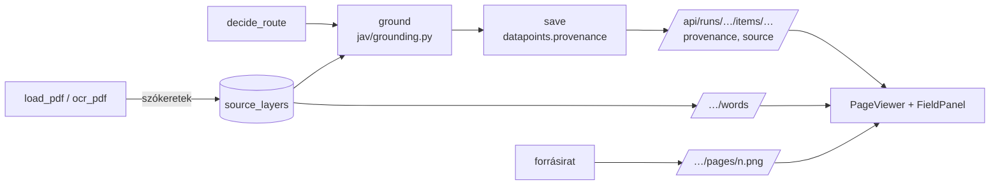

# Architektúra — a folyamat végponttól végpontig és a négy sík

**Dátum:** 2026-09-27 (fejléc) · **Állapot:** a ténylegesen működő szerkezet leírása. A tervezett célszerkezet: 040 terv (belső: `plans/040/PLAN.md`) 3–6. pontja (munkacsomag, futtatás, teendő, riport; hat garancia). A dátumozott bekezdések a saját körük megállapításai. A 038-as garanciahatárokat a K1 (2026-09-27) rendezte a feldolgozón át futó útra; a régi parancssori mérési utak viselkedése változatlan (6. pont).

**039, 2026-09-22 — tervezett rendezés:** célarchitektúra és migráció (belső: `plans/039/PLAN.md`). A `jav/` csomag megmarad, felelősség szerinti alcsoportokkal; közös runtime/provider/storage, iratos/levelezési/review/kimeneti modulok, vékony CLI/API és új UI. A régi DB/facade nem válik az új keret runtime-függőségévé. Ezek tervezett elemek, **a mai kód nem költözött át**. A helyi HTML-koncepció nem implementált React/API-integráció.

**038, 2026-09-22 — a mai garanciák határa:** az alap `flow`, `flow_detect`, `flow_email` új UUID-s Burr-alkalmazása és trackerje nem azonos a kísérleti futtatók tartós folytatásával. A normál `extract_llm` hibás hívása nincs egységesen naplózva; a `TrialBudget` előzetes hívásszámot foglal, dollárban a már könyvelt költségnél áll le, nem a következő kérés maximális költségét foglalja. További reprodukált rések: intake-útvonal/bemenet/dedup, többokú review lezárás, részleges OCR lefedettségjelzése. A helyi OCR gyengeség esetén konfigurált Azure DI-eszkalációt is használhat, tehát az adatút nem csak OpenAI/JEV. Teljes értékelés és tervezett közösítés (belső: `FRAMEWORK_ASSESSMENT_2026-09-22.md`). Ebben a felmérésben runtime/config nem változott.

**037, 2026-09-22:** `configs/capability_catalog.json` kapcsolja össze a típus- és intentregisztert, a nyolc számlacsomagot és 15 legacy csomagot. `jav/capability_catalog.py` a meglévő betöltőket használva determinisztikus, hívásmentes katalógust készít, effektív sémával, beágyazott mezőútvonalakkal, felismerési leírással, státusszal és forráshashekkel. A csomag megléte nem automatikus routing-bizonylat. Az új konfiguráció a szokásos `cfg` verzió-/hash-jelentésben is megjelenik. Részletek (belső: `CAPABILITY_CATALOG_2026-09-22.md`).

**036, 2026-09-22:** `jav/legacy_packs.py` hash-ellenőrzött régi csomagok szigorú Pydantic-sémáit állítja elő; `jav/legacy_validation.py` a régi validátor változatlan portja. `jav/legacy_runtime.py` a meglévő `flow_learning` gráf szolgáltatása (GPT-kivonat → kódos validálás + JEV mezőtámogatás → mentés), saját SQLite/Burr-állapottal és válasznaplóval. `jav/provider_generation.py` a típusos GPT-kimenetet a használati adatok feldolgozása előtt menti. Az öt regisztrált kontraktus változatlan, a 15 új csomag még explicit típusválasztású kísérlet. A külön `expansion_trial` e-mailpróbája tartós válaszbizonylatot használ, nem e-mailes Burr-gráfot. Eredmények és technikai határok (belső: `EXPANSION_2026-09-22.md`).

**Kiegészítés, handoff 035:** `jav/matter_review.py` elkülönített Burr-kísérlet: GPT-döntés → független natív Pydantic AI/JEV-döntés → kódos összevetés. Saját SQLite-munkászár, immutable identitás, hívás előtti jelző és mentett válasz; félbemaradt hívást nem ismétel, végállapotot provider-függőség nélkül olvas vissza. Kizárólag jelölteket ad, nem ír üzemi ügykapcsolatot. A regisztrált kontraktusok száma továbbra is öt; a kereső és az emberi döntési felület portja nyitott. A minimális GPT-kontroll korábbi JEV-válaszokat használ, azoknak nem tulajdonít új hívást vagy költséget. Mért eredmény és hiányok (belső: `LEGACY_CAPABILITIES_AND_JEV_2026-09-22.md`).

**Kiegészítés, handoff 034:** a kísérleti `stack_trial.run_trial` a meglévő számlagráf G-karját is futtatja, külön generátorazonossággal és körre korlátozott `extract_llm.use_agent_factory` függőséggel. A `gpt_jev_comparison` a GPT után megáll, rögzíti a JEV nélküli alapváltozatot, majd ugyanonnan folytatja az eredeti ellenőrző ágat. Ez nem új gráf. A `claim_assessment.review_proposal` külön opcionális szerep-/állapottámogatási jeleket is őriz, az összesített válasz mellett; az 1.1.0 kísérleti kérdéskészlet külön konfigurációban van. Mért képesség és korlát (belső: `STACK_COMPARISON_2026-09-22.md`).

**Kiegészítés, handoff 032:** a `jav/claim_assessment.py` külön hívható állításvizsgálatot ad dokumentumos és e-mailes forrásokhoz: pontos forráscsomag → OpenAI értelmezés → önálló JEV szerep/állapot → JEV-javaslatellenőrzés → változatlan jelöltbizonylat. A saját válasznapló és SQLite-foglalás a meglévő tanulási futtató mintájára készül; ez önálló fájlos kísérlet, nem hatodik Burr-gráf. Minden eredmény `candidate_only`, `correctness=not_established`, kézi ellenőrzést igényel. Az állításazonosító nem üzleti entitásfeloldás. Próbamenet (belső: `CLAIM_ASSESSMENT_PLAN_2026-09-21.md`).

**Irányadó eszközhasználat, 2026-09-21, módosított handoff 031:** az OpenAI és a JEV egyaránt engedélyezett, e-mailes feladatokhoz is. A keret mindkettő képességeire építhet, feladatonként mért munkamegosztással. Az alábbi meglévő gráfok leírása nem korlátozza az OpenAI-t kizárólag kivonatgenerálásra vagy a JEV-et minden értelmező döntés egyedüli eszközére. Forrásellenőrzés, külön elszámolás és kézi aktiválás megmarad; friss engedély (belső: `handoffs/031-2026-09-21-handoff.md`).

**Kiegészítés, handoff 031:** ötödik, opt-in `email_learning` Burr-gráf (`jav/flow_email_learning.py`): alapválasz → forrásbejárás → forrásos intent → jelöltmentés. A `jav/source_evidence.py` a közös veszteségmentes darabolóból eredeti helyekkel ad automatikus forrásjelölteket; külön kezeli a bejárást és a kiválasztást. A teljes részbejáráson mért injekciójel nem veszhet el a végső részletválasztásnál. Saját válasznapló és folytatás: `jav/email_learning_runtime.py`; kézi nézet/címke/export: `jav/email_review.py`. A jelöltet nem aktiváljuk és nem nevezzük etalonnak. Az üzemi M3 és küszöbök változatlanok; mérés (belső: `EMAIL_LEARNING_2026-09-21.md`), [kontrakt](flows/email_learning/FLOW.md).

**Kiegészítés, handoff 030:** a kísérleti `jav/evidence_learning.py` ugyanazon `document_learning` Burr-gráf elé illeszt legfeljebb 8000 karakteres, eredeti forráshelyekre visszavezethető részletcsomagot. A forrásrészek kijelölése explicit, nem automatikus keresés; a marker/átugrott rész nem forrásidézet. Az általános ellenőrző opcionális mezőformátum-kaput és alapból kikapcsolt, egyedi pontos környezetbővítést kapott. A helyi bizonylat, a kiválasztott környezetre érvényes támogatás és a nem megállapított dokumentumhelyesség külön marad. Élő próba és korlátok (belső: `LONG_DOCUMENT_TRIAL_2026-09-21.md`). Üzemi gráf, küszöb és típuskészlet nem változott.

**Kiegészítés, handoff 027:** a három meglévő üzleti gráf mellett új, kísérleti `document_learning` gráf fut (`jav/flow_learning.py`, `jav/learning_runtime.py`): explicit generáló modell vagy importált javaslat → JEV → változatlan bizonylat. JSON-állapotot, tartós SQLite Burr-mentést, saját külsőválasz-naplót és munkakönyvtárankénti kizáró foglalást használ. A három régi gráf nem változott; a teljes típusfelismerési/beérkeztetési útba ez még nincs bekötve. [Kontrakt](flows/document_learning/FLOW.md), mérés és korlátok (belső: `LEARNING_FLOW_TRIAL_2026-09-21.md`).

**Felhasználói pontosítás, 2026-09-21, handoff 022:** az eredeti fő cél az általános AI-flow-keretrendszer és a JEV–Pydantic AI–Burr összeállítás hatékonyságának, megbízhatóságának mérése. A tanítható dokumentumfeldolgozás kiegészítő cél; a két irány együtt halad. A közös forrás- és szerkezetellenőrző képességek mindkettőt szolgálják.

**Célbővítés, 2026-09-21:** ismert típusnál verziózott feldolgozási recept, ismeretlennél általános adatpont-javaslat és forrásellenőrzés. A részletes terv (belső: `DOCUMENT_LEARNING_2026-09-21.md`) megkülönbözteti a célállapotot és a már elkészült, kísérleti JEV-forráskeresőt; az alábbi meglévő gráfok még nem valósítják meg ezt a teljes utat.

Kézzel írt leírás (2026-09-20). A generált részek: a gráfok `docs/flows/<flow>/FLOW.md`, a Jev-hívási helyek
katalógusa `docs/callsites/`, az állapot-pillanatkép `docs/STATE.md` (`python -m jav.cli admin --write`). Terv és
cél: `docs/ROADMAP.md`; mért eredmények: `README.md`; szabályok: `CLAUDE.md`; teendők: `docs/BACKLOG.md`; döntések:
`docs/DECISIONS.md`; a Jev-lehetőségek: `docs/JEV_PLAYBOOK.md`.

**Mi ez (2026-09-20-i cél):** egy általános, többnyelvű dokumentum- és e-mail-feldolgozó **AI-flow-keretrendszer**
(Burr + Pydantic + sidecar + Jev), amelyben a flow-k példányok, a keret-réteg (adapter, regiszter-séma, hívási
hely-séma, policy-séma, eval, store, kontrakt, bemenet-illesztők) közös. Az alábbi folyamat a három referencia-flow-t
mutatja (M1 kategorizálás, M2 magyar számla két karral, M3 e-mail szándék); egy új flow ugyanezekre a síkokra ül rá
(`docs/ROADMAP.md` §10).

## 1. A folyamat egy levéltől a döntésig

```
asztali Outlook ──(régi 10_AIFLOW_V4/scripts/outlook_bridge.ps1, csak olvas)──► POST /ingest/email
      │                                                                              │
      │ csatolmány-fájlok a régi data/inbox/email/<acct>/<eid>/ alá                   ▼
      │                                                            jav/ingest_server.py (a bridge protokollja)
      │                                                                              │ message.json
      ▼                                                                              ▼
 inbox/<mailbox>/<msgid>/  ─────────────────────────────►  M3 email_intent gráf (jav/flow_email.py)
                                                              load_message → classify_attachments → intent → route → save
                                                                                   │                    │        │
                                                     PDF-enként az M1 gráf ◄───────┘                    │        └─► store.emails + review_queue
                                                     (jav/flow_detect.py)                               │
                                                     load_pdf → detect → save                           ▼
                                                              │  Jev: doc_type + issuer_hu + language   policy.email_next_flow (kód)
                                                              ▼                                          │
                                                        store.documents                                  ▼
                                                                                    m2:<típus> · m1:detect · human:* · archive*
 mappa-korpusz (913 PDF) ──► detect-corpus ──► M1 gráf dokumentumonként ──► store.documents (típus × év riport)

 store.documents[invoice_hu | invoice_foreign] ──► M2 invoice gráf (jav/flow.py; a típus-csomag configs/types/<típus>.json adja a mezőket, kérdéseket, promptot, validátorokat), két kar egy gráfban:
     S: find_candidates (kód) → jev_select (Jev Choice, 3 kötegelt kérés) → normalize_picks
     G: extract_llm (gpt, Pydantic AI) → jev_verify (kód-evidencia + Jev Noul fan-out) → normalize_llm
     mindkettő → validate (kód) → decide_route (policy) → save → done | needs_review
```

A **golden-hurok** minden flow-nál ugyanaz: golden-készlet (régi projektből hivatkozva, PII marad ott) → futás
cache-sel (a kérés-hash miatt $0) → riport (`runs/*.jsonl` + Markdown) → eltérés-elemzés a nyers futásból →
általános szabály (konfig-változás verzió-lépéssel) → újrafuttatás → determinizmus-mérés cache nélkül. Az élő
adatból kézi címkéző lista (`*_manual_sample.md`) → saját golden (`golden_labels`).

## 2. A négy sík

| sík | mi | hol | vezérlés |
|---|---|---|---|
| **Flow** (Burr) | három gráf, `@action.pydantic` tipizált állapot, `run_id` = app_id, lokális tracker | `jav/flow.py`, `flow_detect.py`, `flow_email.py`; `CONTRACT` mindhárom végén | `python -m jav.cli flows` lint + FLOW.md; tracker UI `burr` |
| **Döntés** (Jev + gpt) | négy Jev-hívási hely (detect, email_intent, select, verify) és egy generatív lépés (extract_llm); az adapter (`jav/adapters/jev.py`) a konkrét modellverziót teszi a cache-kulcsba, RetryPolicy-val hív, SDK-hibát `JevUnavailableError`-ként ad tovább | kérdéskészlet `configs/callsites/*.json`, regiszterek `configs/doc_types.json`, `intents.json`; kód: `jav/detect.py`, `intent.py`, `jev_select.py`, `jev_verify.py`, `extract_llm.py` | `configs` (verzió, hash), `docs/callsites/` katalógus, sávok és útvonalak `configs/policy.json` (`bands` / `band_for`, `jav/policy.py`) |
| **Adat** (SQLite) | documents · datapoints · emails · review_queue · ledger · golden_labels | `store/jav.sqlite`, `jav/store.py` (additív migráció) | `store` statisztika; a ledger minden AI-hívást `config_hash`-sel és hiba esetén `error`-ral rögzít |
| **Mérés** (eval) | flow-független ítélet-lista a nyers futásokból: pontosság és sáv kérdésenként, kalibráció (ECE), top-prob vs. conf, policy-újraértékelés hívás nélkül, determinizmus | `jav/eval_report.py` (bemenet `runs/*.jsonl`), a flow-specifikus futtatók `jav/evals*.py` | `eval-report` → `runs/<idő>_eval_report.md`; golden / determinism parancsok flow-nként |
| **Adminisztráció** | konfig-verziók és hash-ek, modellek és árak, lint, golden-eredmények, review-sor; session-szabályok és hookok | `jav/cfg.py`, `configs/models.json`, `jav/admin.py`, `CLAUDE.md`, `.claude/settings.json`, `scripts/hooks/` | `admin` egy képernyőn; hookok: handoff-betöltés, compact-figyelmeztetés, Stop-blokk, handoff-review (Fable) |

## 3. Hol dől el mi — a döntési hierarchia a gyakorlatban

1. **Kód** (determinisztikus, tesztelt): jelöltkeresők, validátorok, törzs-tisztítás, anchor-feature-ök, evidencia-illesztés,
   `next_flow`, review-latch. Ez a mechanizmus.
2. **Jev** (ítélet véges opciók fölött): választási, jelenlét- és ellenőrző lépések egyik eszköze. Egy hívási hely = egy JSON konfig
   + egy `build_state` + egy `build_questions` + egy `jev.ask(...)` az adapteren. Nyers valószínűség a state-ben,
   küszöb csak a `policy.json`-ban: nevesített sáv-készlet hívási helyenként (`band_for`), Noul no / uncertain / yes,
   Choice auto / uncertain / human (conf-küszöb + második-opció rés); az `uncertain` sáv csak `uncertain_review: true`
   mellett review-ok. A kérés-hash cache miatt ugyanaz a (konkrét modellverzió, state, kérdések) → ugyanaz a válasz
   $0-ért; az alias (`jev-latest`) szondával oldódik fel (`runs/cache/_model_versions.json`, 24 h TTL). Ha a Jev az
   SDK újrapróbálkozásai után sem válaszol, az adapter ledgerel (`error`) és `JevUnavailableError`-t ad; a flow-k ezt
   `jev_unavailable:<ok>` review-okká alakítják (M1/M3 `final_status = jev_unavailable`), nem dőlnek el.
3. **OpenAI, Pydantic AI-illesztéssel**: a meglévő G-kar és a dokumentumtanulási ág strukturált javaslatokat készít, majd forrásellenőrzést alkalmaz. További értelmező, besoroló és ellenőrző szerepek is engedélyezettek; az új munkamegosztást célzott mérés alapján kell beépíteni. A Burr-állapotok sima Pydantic modellek, nem Pydantic AI.
4. **OCR-lánc (2026-09-20, B5 első fele)**: `jav/ocr.py` + `configs/ocr.json` — szöveg nélküli PDF → oldalkép (pypdfium2,
   300 dpi) → tesseract szó-dobozok (natív tesseract a gépen, a magyar + angol nyelvcsomag a régi sidecar Docker-képéből
   `tools/tessdata`; tartalék: a régi sidecar-kép `docker run`-nal) → ugyanaz a sor- / cella-építő, mint a szövegrétegnél
   (`jav/pdf.py: build_layout`). Külön gráf-lépés (`ocr_pdf`) az M1 és M2 gráfban, lemez-gyorsítótár `runs/ocr/`,
   minőségjelek nyersen a state-ben, küszöbök a `policy.json` `ocr` blokkjában. A régi sidecar többi része (torch, matcher,
   Azure DI) továbbra sincs itt; nehéz függőség csak sidecar mögé kerülhet.

## 4. Hangolás és változtatás — a rend

| változtatás | hol | mi követi |
|---|---|---|
| típus- vagy szándék-leírás (`what`), határ (`not_for`), példa (`examples`), család (`parent`) | `configs/doc_types.json` / `intents.json` (séma v2), `meta.version` léptetés + changelog | `detect-golden` / `email-golden` (új hash → élő hívások), `detect-determinism` / `email-determinism`; `eval-report` (szülő-címke szakasz); `docs` regenerálás |
| Jev-instrukció, Noul-kérdés | `configs/callsites/<hely>.json` | ugyanaz; a `docs/callsites/<hely>.md` mutatja a verziónkénti statisztikát |
| sáv, küszöb, útvonal | `configs/policy.json` (`bands`, `band_for`, útvonalak) | nem kell újrafuttatni: `eval-report` a nyers futásokból (`runs/*.jsonl`) mutatja, hány eset váltana sávot |
| modell, ár, timeout, retry, cache-verzió, alias-TTL | `configs/models.json` | a `cache_version` léptetése minden cache-kulcsot érvénytelenít; a modellverzió-váltás (szonda) magától új kulcsot ad |
| gráf-lépés | flow-modul + `CONTRACT` | `flows` lint + FLOW.md |
| kód (regex, tisztító, validátor) | `jav/*.py` + teszt (TDD) | `pytest`, `recall`, golden |

Csapdák: a `use_cache=False` futás **frissíti** a cache-fájlt (referencia-frissítés), kivéve a determinizmus-mérést,
amely `JevAdapter.no_cache_write()` alatt fut (2026-09-20-tól): olvasás és írás nélkül, a referencia-válasz érintetlen.
A régi inbox-mappák csak csatolmányt tartalmaznak; a Choice-kritérium bármely változása új cache-kulcs. A cache-kulcsban
2026-09-20-tól a konkrét modellverzió van (a `cache_version` 2-re lépett vele együtt): egy fully-cached golden-futás is
igényel egy szondát naponta (API-kulcs kell; offline a fájlban lévő feloldás marad, figyelmeztetéssel).

## 5. Amit a Claude-nak tudnia kell a hatékony fejlesztéshez

- Session-protokoll és handoff: `CLAUDE.md` §2; a hookok kényszerítik (SessionStart / PreCompact / Stop / handoff-review).
  Session-indítás: `python -m jav.cli preflight` (pytest + lint + konfigok + handoff-frissesség + `docs/STATE.md`), majd
  a teljes handoff (a hook betölti), `docs/BACKLOG.md`, `docs/DECISIONS.md`. Az állapot-számokat sehova ne másold kézzel:
  a generált `STATE.md`-re hivatkozz. Handoff a `docs/handoffs/TEMPLATE.md` szerint.
- Jev-kérdés tervezése: `docs/JEV_PLAYBOOK.md` (a doksi tényei, rés-elemzés hívási helyenként, checklist).
- Új Jev-kérdés: konfig-JSON + `build_questions` (regiszter-hivatkozás `registry:<név>`), a `docs.typesafe.ai` cookbook, teszt
  a `tests/test_cfg.py` mintájára, golden-futás előtte-utána.
- Új flow: modul + `CONTRACT` + `TERMINALS` + `build_app` (tracker-projekt a `models.json`-ban) + lint + golden-futtató az
  `evals_*.py` mintájára; a flow soha nem importál SDK-t, csak az adaptert.
- Előbb a régi projektben keress (`CLAUDE.md` §3), és a döntést mondd ki a handoffban.

## 6. Futtatási réteg: munkacsomag → futás → feldolgozó (040 K1, 2026-09-27)

**Laikus összefoglaló.** Az iratok munkacsomagba kerülnek, a csomaghoz recept tartozik, és a futás egy tartós
munkasoron át, a háttérben megy végig. Minden fizetős hívás előtt bejegyzés és költségfoglalás készül. Leállás után a
futás a mentett lépéstől folytatódik, a már kifizetett hívás nem ismétlődik. Teendőt okonként lehet rendezni, és az
éles futást csak nyitott teendő nélkül lehet jóváhagyni.



| Réteg | Fájl | Garancia | Teszt |
|---|---|---|---|
| Munkacsomag, recept, futás | `jav/work.py`, `configs/recipes.json` | verzióütközés → `RevisionConflict`; készenlét-akadályok; rögzített bemenet; idempotens indítás; jóváhagyás csak éles módban, nyitott teendő nélkül | `tests/test_work.py` |
| Munkasor | `jav/runtime/queue.py` | dedup-kulcs, foglalás, próbálkozás + várakozás → `dead`, visszaengedés, leállítás, induláskori árvafoglalás-kezelés (a V4 `jobq.py` mintája) | `tests/test_runtime_queue.py` |
| Hívásnapló, keret | `jav/runtime/calls.py` | foglalás a hálózat előtt; sikertelen hívás is naplózva; ismeretlen költség lekötve; bizonytalan kísérlet nem ismétlődik; sikeres lépés visszajátszása | `tests/test_runtime_calls.py`, `tests/test_runtime_adapters.py` |
| Feldolgozó | `jav/runtime/worker.py` | stabil azonosító + Burr-állapotmentés (`burr_state.sqlite` az adattár mellett); folytatás a következő lépéstől; leállítás lépéshatáron; megváltozott forrás elutasítva | `tests/test_runtime_worker.py`, `tests/test_work_cli.py` |
| Teendők | `jav/store.py` `review_reasons` | okonkénti felvétel és zárás felvevő lépés szerint; emberi döntés szerzővel | `tests/test_review_reasons.py` |
| Részleges OCR | `jav/policy.py` `ocr_coverage_reasons` | kihagyott oldal = mindig teendő | `tests/test_ocr_coverage.py` |
| Levélfogadó | `jav/ingest_server.py`, `jav/emails.py` | gyökéren belüli útvonalak, méret- és szerkezetkorlát, opcionális kulcs, tartalomhash-es ismétlésvédelem | `tests/test_ingest_security.py` |
| Üzemi védőháló (063) | `jav/runtime/worker.py`, `jav/runtime/queue.py`, `jav/mailbox.py`, `jav/app_settings.py`, `jav/work.py` | a feldolgozó hurok váratlan hibán nem áll le (a feladat lezárul, a hiba naplózva); az árva feladat legfeljebb 3-szor indul újra, utána halott, a leállás alatt kért leállítás induláskor lezárul; a félbemaradt futásindítás ismétléskor pótlódik, és addig nem „kész”; a megszakadt levélletöltés megérkezett levelei csomagba kerülnek; a figyelt mappa a fájlt csak sikeres felvétel után jelöli látottnak, egy mappát egyszerre egy folyamat néz át; a PDFium-hívások zár alatt futnak | `tests/test_stability_063.py` |
| Napló, mentés (063) | `jav/runtime/applog.py`, `jav/backup.py` | állandó, forgó napló (`runs/logs/`); adattár-mentés futás közben is, sértetlenség-ellenőrzéssel (`python -m jav.cli backup`) | `tests/test_stability_063.py` |
| Napi mentés, tár-ritkítás (064) | `jav/backup.py`, `jav/runtime/persistence.py`, `jav/runtime/worker.py`, `scripts/backup-task.ps1`, `configs/service.json` `backup` | napi ütemezett mentés, ellenőrzött másolat a második helyre, állapotfájl és felületi figyelmeztetés; a lezárt tétel folyamat-állapotaiból csak az utolsó marad (a Burr `load` is csak azt olvassa); `burr-prune` a régi tár egyszeri ritkítására és tömörítésére | `tests/test_ops_064.py`, `ui/src/ops064.test.tsx` |

**Határok.** A napló és a keret csak a feldolgozón át futó úton él (`calls.use_run`). A régi parancssori mérések
(`golden`, `determinism`, `run` …) a korábbi módon hívnak, hogy a lezárt mérések összevethetők maradjanak; ott csak a GPT
hibanaplózása javult. Egyszerre egy feldolgozó futhat (a K2 óta zár őrzi, lásd 7.). Az e-mailes folyamat 048 óta recept (levél-szándék, 11. pont), a K5 (058) óta a csatolmányokkal együtt. A régi kísérleti
`TrialBudget` változatlan, mert a lezárt kísérletek arra épülnek. Hibaszondák a javított kódon:
`runs/20260927_k1_audit/probes.json`.

## 7. Helyi szolgáltatás (040 K2, 2026-09-27)

**Laikus összefoglaló.** A felület és a parancssor ugyanazt a kaput használja: egy csak a saját gépről elérhető
szolgáltatást. Ez nem futtat semmit, csak sorba tesz és az adattárból olvas; a feldolgozást a különálló feldolgozó végzi,
ezért a böngésző vagy a szolgáltatás bezárása nem állítja le a futást. Idegen gépről vagy weboldalról jövő, túl nagy, nem
JSON-alakú vagy ismeretlen mezőt tartalmazó kérés nem jut el az üzleti műveletig. Irat csak az engedélyezett mappákból
vehető fel. A mezőjavítás verziózott: elavult alapra épülő mentést elutasít.



| Réteg | Fájl | Garancia | Teszt |
|---|---|---|---|
| Kapu | `jav/api.py`, `configs/service.json` | csak loopback cím; `Host`- és `Origin`-ellenőrzés; író kérés csak JSON; törzsméret-korlát darabolt küldésnél is; Pydantic-séma ismeretlen mező elutasításával; azonosító-minták; mappa és fájl: létező útvonal (hivatkozás feloldva), 061 óta bárhol — a `restrict_paths: true` beállítással csak engedélyezett gyökér alatt | `tests/test_api.py` |
| Közös nézetek | `jav/work_views.py` | a parancssor `--json` kimenete és a szolgáltatás válasza ugyanaz; pénz szövegként, nem lebegőpontosan | `tests/test_api.py::test_cli_and_service_give_the_same_answer` |
| Mezőjavítás | `jav/corrections.py` | verzió + 409 ütközésnél; csak a típuscsomag mezője; pénz és dátum kódban ellenőrizve; jóváhagyott futásnál tilos; a gépi adat megmarad | `tests/test_api.py::test_correction_is_versioned_and_conflict_is_refused` |
| Feldolgozó-zár, leállítás | `jav/runtime/lock.py`, `jav/runtime/worker.py` | operációsrendszer-zár (összeomláskor magától feloldódik); leállítási kérés a folyamatban lévő tétel után | `tests/test_api.py` |
| Indítás | `scripts/dev.ps1 start/status/stop` | szolgáltatás + egy feldolgozó a háttérben, napló a `runs/dev/` alatt | kézi próba (2026-09-27) |

**Hibakódok:** 404 ismeretlen azonosító · 409 verzióütközés, nem indítható vagy nem jóváhagyható · 413 túl nagy törzs ·
415 nem JSON · 422 hibás bemenet vagy hiányzó szerző · 403 idegen gép, idegen eredet vagy tiltott mappa. Emberi döntéshez
(jóváhagyás, javítás, teendő zárása) az `X-Actor` fejléc kötelező. A végpontok listája futó szolgáltatásnál: `/api/docs`.

**Határok.** Nincs bejelentkezés és jogosultság (egyfelhasználós helyi eszköz, 040/7.). A V4 végpontneveit követjük
(`workflow`, `readiness`, `start`, `runs`), a munkacsomag neve `workpackages` a V4 `intake-batches` helyett. A riport-
végpont a futás tételenkénti eredménye (gépi adat, javítás, összefésült érték); az export és a közmű-költség riport a K4-ben
(054) készült el (10. pont, Riportok sor).

## 8. Munkafelület (040 K3, 2026-09-27)

**Laikus összefoglaló.** A böngészős felület a helyi szolgáltatás címén nyílik meg (`http://127.0.0.1:8930/`), külön
szerver nélkül. Első változatának három menüpontja volt (Munkacsomagok, Futtatás, Riportok); 057 óta a főmenü Munkacsomagok +
Beállítások (10. pont, Felület-szerkezet). A felület
nem tartalmaz üzleti szabályt. Minden döntést (verzió, készenlét, jóváhagyás) a szolgáltatás hoz, a felület csak
megjeleníti és továbbítja. A javítás a forrásirat mellett történik, és sikertelen mentésnél nem vész el.

| Rész | Fájl | Mit tud | Viselkedési garancia (teszt) |
|---|---|---|---|
| Keret | `ui/src/App.tsx`, `ui/src/styles.css` | oldalsáv (057 óta két menüpont), feldolgozó-állapot, „Ki dolgozik?” (061: nem üres névlistánál kötelező választás a listából, „Mai munkám” hivatkozás) | `ui/src/users.test.tsx` |
| Útvonal | `ui/src/route.ts`, `ui/src/hooks.ts` | a kiválasztott csomag, futás és tétel a címben (könyvjelzőzhető) | eltűnt csomag helyett nem nyílik meg másik; régi válasz nem írja felül az újat |
| Munkacsomagok | `ui/src/views/Workpackages.tsx`, `WorkpackageDetail.tsx` | lista, létrehozás mappából vagy fájlokból, Tételek, Folyamat (recept, készenlét, próba vagy éles indítás) | verzióütközésnél újratöltés, a beállítás megmarad |
| Teendők | `ui/src/views/ReviewWorkspace.tsx`, `ui/src/review/FieldPanel.tsx` (045 óta; a korábbi javító-szerkesztő kivezetve) | tételsor, forrás-PDF, saját és korábbi teendők, okonkénti rendezés, mezőjavítás | a munkapéldány hálózati hibánál és ütközésnél is megmarad |
| Futtatás | `ui/src/views/Runs.tsx` | lista, részletnézet futás közbeni frissítéssel, keret-sáv, munkasor, hívásnapló kibontva, leállítás, jóváhagyás | – |

**Technika.** React 19, Vite 8, TypeScript 5.9, tesztek: Vitest 4 + Testing Library (jsdom). Összesen 108 npm-csomag,
nincs komponenskönyvtár. A betű (Geist) helyi csomagból jön, internet nem kell hozzá. A build a `ui/dist/`-be kerül
(git-ignorált), és a szolgáltatás a gyökéren adja ki. A belépő HTML-t a böngésző mindig újrakéri. Fejlesztéshez az
`npm run dev` (5173-as port) az `/api` hívásokat a szolgáltatáshoz továbbítja. A preflight lefuttatja a felület
típusellenőrzését és tesztjeit, ha a `ui/node_modules` telepítve van.

**Határok.** A „Ki dolgozik?” név nem bejelentkezés (jelszó nincs), hanem aktív felhasználó: 061 óta nem üres névlistánál a szolgáltatás csak a listán szereplő nevet fogadja el emberi műveletnél. A mezők magyar
neve közös felirat-beállításban van (056 óta); 2026-09-29-én mind a 23 típuscsomag minden mezőjének van magyar neve. A forrás megjelenítését a 9. pont
(045) írja le; a böngésző PDF-nézője kivezetve.

## 9. Forráshoz kötött ellenőrzés (045 K3b, 2026-09-28)

**Laikus összefoglaló.** A futás a szöveg beolvasásakor a szavak helyét is elmenti (szóréteg), és minden kinyert mezőhöz
kiszámolja, hol áll az iraton (forráshely). Az ellenőrző felület az irat oldalképén bekeretezi a kiválasztott mezőt.
Megmutatja a többi jelöltet is, és a képen kijelölt szavakból is ki lehet tölteni egy mezőt. Mindez kódban történik,
AI-hívás nélkül. Ha a hely nem egyértelmű, nincs keret, csak magyarázat: inkább nincs keret, mint rossz keret.



| Rész | Fájl | Mit tud | Teszt |
|---|---|---|---|
| Szóréteg | `jav/source_layer.py`, `jav/pdf.py`, `jav/ocr.py` | a beolvasó szókészletéből (szövegréteg, helyi OCR, Azure) oldal-relatív keretek, tartalom szerinti azonosító; a sorok és a JEV-kérések változatlanok | `tests/test_source_layer.py` |
| Forráshely | `jav/grounding.py`, `configs/grounding.json` | S-út: a kiválasztott jelölt a saját sorában (a következő sorokra tördelt szövegrészt ugyanabban a hasábban követi, 046) + a többi jelölt valószínűséggel; ha sehol nem található, közelítő keret a választott soron (`approximate`, 046); keresés: fajta szerinti összevetés, címke-környezet (V4 szótár), nagyobb szám része kizárva, hasábos két soros név; több hely → nincs keret, helyek alternatívaként | `tests/test_grounding.py` |
| Folyamatlépés | `jav/flow.py` `ground` | `decide_route → ground → save`; hiba esetén forráshely nélkül tovább | kontrakt-lint, `test_flow_run_saves_provenance` |
| Javítás hellyel | `jav/corrections.py` | kijelölt szavak (`sources`) verzióval; érvényes hely: kézi > a javított érték keresése > gépi; a javított mező régi kerete csak alternatíva | `tests/test_api.py` |
| Végpontok | `jav/api.py`, `jav/page_image.py` | oldalkép (PNG, 72–200 dpi, hash-védett), szóréteg, normalizálás, beállítások | `tests/test_api.py` |
| Felület | `ui/src/review/` | oldalkép, keret a sáv színével, kattintás a képen, alternatívák, kijelölés (szó, téglalap), munkapéldány-tár, elválasztó, gyorsbillentyűk | `ui/src/behaviour.test.tsx` |

**Mérés (hívás nélkül).** 21 szövegréteges etalon-irat, csak keresés (a G-út és a kézi javítás útja): 269 értékből 154
keret, 61 több lehetséges hely, 49 nem található (főleg az etalonban más alakban szereplő címek, országnevek). Az élő
próba 5 számlája a gyorsítótárból újrafuttatva (S-út, 0 fizetős hívás): 82 kitöltött mezőből 71 keret, 13 alternatíva. 046 után (`run-04fca1b36fbb`, 0 fizetős hívás): 77 pontos keret + 1 közelítő, és az egyetlen ellenőrizendő mező (a két sorba tördelt IBAN) is pontos keretet kap; bizonyíték: `runs/20260928_k3b_grounding/replay_046.json`.
Bizonyíték: `runs/20260928_k3b_grounding/`.

**Határok.** A régi futásokhoz és a régi OCR-gyorsítótárból olvasott iratokhoz nincs szóréteg (felhasználói döntés:
a réteg a futás közben készül). A tételsorok helye a képen 053 óta megvan (10. pont, Keretek és tételsor-helyek). A keret helyessége nem pontosság: a
keret azt mutatja, honnan jön az érték, nem azt, hogy az érték helyes.

## 10. Egységes dokumentumtípusok (047 T1, 2026-09-28)

**Laikus összefoglaló.** A régi projekt mind a 23 dokumentumtípusa teljes típuscsomag. A felismerés a durva kategória
után kiválasztja a részletes típust, a kinyerés annak csomagjával fut, a régi eredmények pedig összevetésre
behozhatók. Mérés: T1 jelentés (belső: `reports/2026-09-28-t1-tipusegyesites.md`).

| elem | fájl | mit csinál |
|---|---|---|
| Csomagformátum | `jav/typepack.py`, `jav/models.py` | `list` mező tétel-leírással (`list_fields`), `boolean`, felsorolt értékek (`enums`, megsértése teendő); `arms`, `parent`, `auto_detect`, `detect` (régi kulcsszavak) |
| Átalakító | `jav/typepack_convert.py` | régi típus-másolat (`configs/legacy_types/`) → csomag + G-kar ellenőrző hívási hely; séma és prompt verbatim, származás a manifest sha256-jaival |
| Kivonat-szabályok | `jav/validators.py` → `jav/legacy_validation.py` | futó egyenleg, záró egyenleg, összegek, időszak — rekord-ellenőrzésként |
| Részletes típus | `jav/detect_detail.py`, `configs/callsites/detect_detail.json`, `policy.json detect_detail` | egy jelölt → az; régi horgony-pontszám az irat elején (V4 `anchor_check`), egyértelmű előnynél kód dönt; különben JEV Choice `none`-nal; nyitva maradt típus = teendő |
| Recept | `configs/recipes.json` `document-processing`, `jav/runtime/worker.py` | lépcsők: felismerés → kinyerés a részletes típus csomagjával; a kar a kért, ha a csomag támogatja |
| Számlatételek (053 T3) | `configs/types/{invoice_hu,*_szamla}.json`, `jav/validators.py`, `jav/policy.py` | `line_items` tételes lista a GPT-séma tétel-mezőivel; `line_items_total` (tételösszeg = végösszeg, egy teljes oldal elég) és `line_items_arithmetic` (soronkénti számtan, a MOHU-n nincs); `"review": false` = csak jelzés (`CheckResult.advisory`, a teendő-szabály kihagyja); `default_arm` + recept `arm=auto` (közmű: G) |
| Keretek és tételsor-helyek (053) | `jav/grounding.py` (`locate_value`, `locate_rows`, `ground_lists`), `jav/reground.py`, CLI `reground`, `ui/src/review/PageViewer.tsx` | több helyen szereplő érték: keret a legvalószínűbb helyen (`multiple`, alternatívák); pénznem-jelek („Ft”); táblázat-oszlopok nem olvadnak össze egy számmá; a lista sorai `provenance[lista].rows`; meglévő futás újraszámolása (a futás közbeni választás helye marad); a képen minden keret halványan, a kiválasztott erősen |
| Riportok (054 K4) | `jav/export.py`, `jav/report_utility.py`, `configs/reports.json`, API `/runs/{id}/export`, `/runs/{id}/reports/utility-cost`, `ui/src/views/UtilityReport.tsx` (057 óta a csomag Eredmény szakaszában) | export a futás érvényes adatából (`run_records`: gépi + javítás, érvényes forráshely, nyitott teendők); CSV `;` + BOM + képlet-védelem, XLSX szöveg sosem képlet; közmű-rács: napos arányosítás Decimal-lal, ismétlődő (típus + számlaszám) és elszámoló számla, vízösszesítő csak tájékoztató; a régi `tabular.py` és `csv.ts` segédjei portolva |
| Egységes adatnézet (056 U1) | `jav/tablequery.py`, `jav/datasets.py`, `configs/datasets.json`, `configs/field_labels.json`, API `GET /datasets`, `POST /datasets/{name}/query`, `POST /datasets/{name}/export`, `ui/src/components/` (DataTable, Picker, DatasetPicker, DownloadPanel, Popover), `ui/src/views/ResultStage.tsx` (057 óta a külön adatnézegető helyett a csomag Eredmény szakasza) | 11 adatkészlet oszlopleírással; keresés (ékezet nélkül), oszlopszűrők, magyar rendezés (ö/ő, ü/ű külön betű; vegyes szöveges oszlopban a tiszta szám számként), lapozás a szolgáltatásban (döntés 2026-09-28); a futás adata (`datasets.run_records`) ujjlenyomatig gyorsítótárban, közös a táblákkal, a közmű-riporttal és a teljes exporttal; letöltés minden / szűrt / kijelölt sorra, választott oszlopokkal (a `jav/export.py` CSV- és XLSX-írójával); felület: TanStack Table 8 + Virtual (80 sor fölött csak a látható sorok) |
| Felület-szerkezet (057) | `ui/src/App.tsx`, `ui/src/route.ts`, `ui/src/views/WorkpackageDetail.tsx` (+ `ProcessStage`, `ResultStage`, `DocumentsPanel`), `ui/src/views/Settings.tsx` (+ `settings/`), `jav/work_views.py` `next_step`, `jav/work.py` `start_run(rerun_of=)` | főmenü: Munkacsomagok + Beállítások; csomag-szakaszok process / review / result, a régi címek átirányítva; a következő lépés a szolgáltatásban, kód + paraméter, a felület fordít |
| Beállítások (057) | `jav/app_settings.py`, API `/settings/users`, `/settings/folders`, `/settings/folders/{id}/scan`, a feldolgozó körében `app_settings.tick()` | felhasználói névlista (helyi adattár); figyelt munkamappák a V4 módján (egy közös / napi csomag, recept, gyakoriság), bármely létező mappa (061; korláttal csak engedélyezett gyökér alatt), csak olvasva, látott fájl (útvonal + méret + mtime) nem hashelődik újra, eltávolított irat nem tér vissza, futás nem indul magától |
| Felhasználók és kiosztás (061) | `jav/app_settings.py` (`canonical_user`), `jav/api.py` (`human_actor` → `UnknownUser` 403 `unknown_user`; a csomag létrehozása, tételei, a recept és a futás indítása is emberi művelet), `jav/work.py` (`workpackages.owner`, `set_owner`), API `/workpackages/{id}/owner`, `jav/activity.py`, `jav/datasets.py` (`workpackages` `owner` hatókör, `activity`), `ui/src/views/Activity.tsx`, `ui/src/hooks.ts` (`useActor`, `useEvent`) | jelszó nélkül; üres névlistánál bármely név (első beállítás); a név a lista alakjában rögzül; a felelős nem jogosultság; a napló a meglévő szerzős sorokból (csomag-események, recept, futás indítása / jóváhagyása, javítás, teendő-lezárás, feladatdöntés, postafiók-letöltés), a nap a helyi naptári nap |
| Futásindítás megerősítéssel (061) | `ui/src/views/StartConfirm.tsx`, `ui/src/route.ts` (`#/workpackages/{id}/process/start?mode=…&rerun=1`) | a futtató gombok a megerősítő oldalra visznek; ott összegzés (mód, csomag, recept a beállításaival, tételszám, legnagyobb költség szolgáltatónként) és az egyetlen indítógomb |
| Csomag kezelése, állapot, ujjlenyomat (058) | `jav/work.py` (`archive_/restore_/rename_/delete_workpackage`, `workpackage_events`, `resolve_reason`, `fingerprint` + `file_fingerprints`), API `/workpackages/{id}/archive|restore|rename|delete`, `jav/work_views.py` `result_tables`, `ui/src/views/WorkpackageActions.tsx` | elrejtés = `workpackages.status='archived'` (a lista `include_archived` hatókörrel kéri); törlés csak futás nélkül, eseménynapló; a teendő lezárása a gazda-futás állapotát frissíti; a készenlét és az oldalkép méret + mtime szerint megjegyzett hash-t használ, az indítás és a feldolgozó teljeset; az Eredmény nézetei a futás adatából (`tables`) |
| Levelek mint második recept (058 K5.1–K5.2) | `jav/store.py` (`email_results`), `jav/emails.py` (`body_coverage`), `jav/flow_email.py` `save`, `jav/mailbox.py` (`email_result_for`, `effective_email_result`, `add_attachments`), `jav/corrections.py` (`_save_email`), `jav/export.py` (`email_records`, `emails_table`), `jav/datasets.py` (`emails`), `jav/work.py` (`parent_item_id`, `flow_for`, `run_budget`), `configs/recipes.json` email-intent v2 | a levél-eredmény futásonként; a szöveg látott része kódban; a szándék javítása verziózott, a következő lépés a javított szándékból kódban, a szándék-teendő a döntéssel zárul; a PDF-csatolmány a csomag irata a levélre mutatva, a recept tétel-fajtánként választ folyamatot (`flows`) és keretet (`max_item_usd_by_kind`) |
| Feladatjavaslat (058 K5.3) | `jav/email_tasks.py` (javaslat GPT-vel a hívásnaplón és a kereten át, `gate`), `jav/flow_email.py` `tasks` lépés (route → tasks → save), `configs/email_tasks.json`, `jav/prompts/email_tasks_prompt.md` (a régi v1.3.0 szó szerint), `store.email_results.tasks` + `email_task_decisions`, `jav/mailbox.py` (`task_view`, `decide_task`), API `/runs/{id}/items/{item}/tasks/{n}/decision` és `/tasks/{n}/done` (062: kézi „elvégezve”, `email_task_decisions.done_by` / `done_at`), `jav/datasets.py` `email_tasks` | a recept `tasks` paramétere (alapból off); archiválandó útvonalon nincs hívás (kód); a kapu a régi szabályokkal (szó szerinti idézet csak a tárgyból / szövegből, ÉÉÉÉ-HH-NN határidő, szó szerinti felelős), hibás javaslat okkóddal kiesik, 062 óta a tartalmával, az elbukott részével (`failed_parts`) és idézetenkénti ellenőrzéssel (`quotes`); az egy levélen belüli azonos javaslatok összevonódnak (`merged`); javaslat → teendő, az emberi döntések után lezárul |
| Nyelv és megjelenés (057) | `ui/src/i18n/` (t, useLocale, en-*.json), `ui/scripts/check-i18n.mjs` (+ `--audit`, a preflight része), `ui/src/appearance.ts` | a V4 i18n-mintája portolva: magyar kulcs, angol szótár csak angolra váltáskor; a szolgáltatás felőli feliratok (adatkészlet-oszlopok, felsorolt értékek, mező-, típus- és receptszövegek) is kötelezők; téma (világos / sötét / rendszer) és sűrűség nézőnként |
| Régi eredmények | `jav/legacy_import.py`, CLI `legacy-import` / `legacy-compare` | a régi köteg-exportok csak olvasva, sha256 szerint, külön táblában (`legacy_results`); összevetés = egyezés, nem pontosság |

**Tételes listák a felületen (048 T1-lista, 2026-09-28).** A `list` mező javítása a teljes lista, cellánként a
tétel-mező fajtája és felsorolt értékei szerint ellenőrizve (`jav/corrections.py` `list_columns`, `_check_list`). A tétel
eredménye (`item_result`) a lista oszlopait (`lists`) és a csomag ellenőrzéseit a javított adaton (`checks`, sorra mutató
hibánál `rows`) is adja. A felületen a jobb panel fülei: Mezők / listánként egy fül (`ui/src/review/ListTable.tsx`); a
lista fülén külön kép–panel arány él. A listasorok kerete a képen 053 óta megvan (a Keretek és tételsor-helyek sor). Teszt: `tests/test_list_corrections.py`,
`ui/src/behaviour.test.tsx` „tételes lista”.

A `documents.doc_type` a durva kategória, a `documents.detail_type` a részletes típus; a `datapoints.doc_type` a
kinyeréshez használt csomag. A régi típus-másolatok forrásként maradnak (hash-ellenőrzés), a külön régi futtató
(`jav/legacy_runtime.py`) még nem vezettük ki.

## 11. Postafiók-olvasás és ütemezés (048 T2, 2026-09-28)

**Laikus összefoglaló.** A Postafiók nézetben megadható, melyik postafiók melyik időszakát olvassuk. Előbb ingyenes
darabszám-előnézet kérhető, utána egyszeri letöltés vagy ütemezés indítható (alap: óránként). A letöltést a feldolgozó
végzi a régi Outlook-szkripttel. Az új levelekből munkacsomag lesz a levél-szándék recepttel, a fizetős feldolgozást
ember indítja. Az Outlooknak futnia kell a gépen.

```mermaid
flowchart LR
  UI[Postafiók nézet] -->|előnézet| API[jav/api.py /mailbox/count]
  API --> W[scripts/mail_bridge_call.ps1] --> B[régi outlook_bridge.ps1 -CountOnly]
  UI -->|letöltés / ütemezés| Q[(munkasor: mail_pull)]
  T[feldolgozó: tick()] --> Q
  Q --> F[mailbox.fetch]
  F --> R[ideiglenes fogadó, egyszer használatos kulcs]
  B2[régi outlook_bridge.ps1] -->|/ingest/email| R
  R --> I[inbox/&lt;postafiók&gt;/&lt;levél&gt;/message.json]
  F --> WP[munkacsomag: levél-tételek + email-intent recept]
```

| elem | fájl | mit csinál | teszt |
|---|---|---|---|
| Előnézet, letöltés | `jav/mailbox.py` `count`, `fetch` | a régi szkript változatlanul; projektgyökere `inbox/.bridge` (csatolmányok, „már beolvasva” lista), nem a régi projekt; minden levél (`-AllEmails`); az új / megváltozott levelekből munkacsomag | `tests/test_mailbox.py` |
| Ideiglenes fogadó | `jav/ingest_server.py` `make_server(0, token=…, on_ingest=…)` | szabad port, egyszer használatos kulcs; a meglévő ismétlésvédelem (azonos tartalom = ismétlés) | `tests/test_mailbox.py`, `tests/test_ingest_security.py` |
| Letöltési napló, ütemezés | `jav/mailbox.py` (`mailbox_pulls`, `mailbox_schedules`), `jav/runtime/worker.py` | minden letöltés munkasor-feladat; a feldolgozó körönként `tick()`; hiba a naplón, nem ismétlődik | `tests/test_mailbox.py` |
| Levél-tétel | `jav/work.py` `add_items(kind="email")`, `review_subject`; `configs/recipes.json` `email-intent`; `jav/flow_email.py` (`run_id`, állapotmentés) | tétel = a levél `message.json`-ja; a teendők alanya a levél azonosítója | `tests/test_mailbox.py` |
| Felület | `ui/src/views/Mailbox.tsx`, `ui/src/review/EmailReview.tsx` | űrlap, előnézet, letöltés, ütemezések, napló; a Teendők fülön a levél és a szándék | `ui/src/behaviour.test.tsx` |

Korlát: a letöltés a feldolgozó szálában fut (percekig is), közben irat-tétel nem halad. A szándék kézi javítása és a
csatolmányok feldolgozása 058 óta megvan (K5.1–K5.2, 10. pont): a PDF-csatolmány a levél csomagjában, a levél-recepttel fut,
nem külön irat-munkacsomagban.
