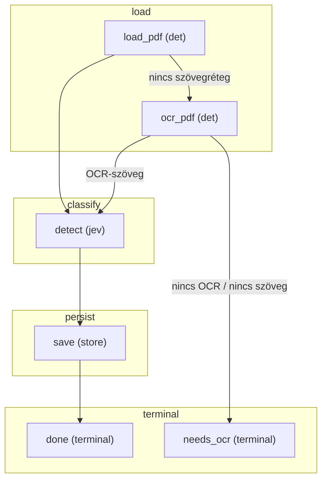

# FLOW — doc_detect

> A flow-modul `CONTRACT`-jából generálva (`jav/contract.py`, `python -m jav.cli flows`). Ne szerkeszd kézzel -
> generáld újra. A fázisonként csoportosított gráf a FLOW.mmd.

## Fázisok és lépések

### load
- **load_pdf** _(det)_ — pdfplumber szó-szintű rekonstrukció, sha256 doc_id, év-hint a mappából; szövegréteg-teszt
- **ocr_pdf** _(det)_ — szöveg nélküli PDF: OCR (jav/ocr.py: oldalkép + tesseract, natív / régi sidecar-kép, lemez-gyorsítótár) ugyanarra az elrendezésre; minőségjelek a state-ben

### classify
- **detect** _(jev)_ — egy kérés, három ítélet: Choice doc_type (regiszter + unknown), Noul issuer_is_hungarian, Choice language; anchor-találatok feature-ként; utána részletes típus a kategória csomagjai közül (jav/detect_detail.py: régi horgony-pontszám, szükség esetén JEV Choice). Without JEV: the same three questions to GPT in one structured request, the confidence from the answer's token log-probabilities (jav/detect_gpt.py); a failed call is a detect:gpt_failed to-do

### persist
- **save** _(store)_ — documents tábla (részletes típus is; nyitva maradt részletes típus = detect_detail teendő; a típuscsomag nélküli kategória is); conf < policy.detect.low_confidence -> review_queue (okonként, additív), különben a detect saját korábbi okai zárulnak

### terminal
- **done** _(terminal)_ — kategorizálva
- **needs_ocr** _(terminal)_ — szöveg nélküli / törött szövegrétegű PDF, és az OCR sem adott szöveget (vagy nincs motor): documents has_text=0; teendő (felvevő `ocr`, ocr:*), a szöveges mentés zárja

Terminális lépések: done, needs_ocr

> M1 - a típus a documents táblába kerül; a típus szerinti M2-flow onnan indul. A run_id a gerinc, a Jev-hívás az adapteren megy (cache + ledger + config_hash).

## Gráf (Mermaid)

