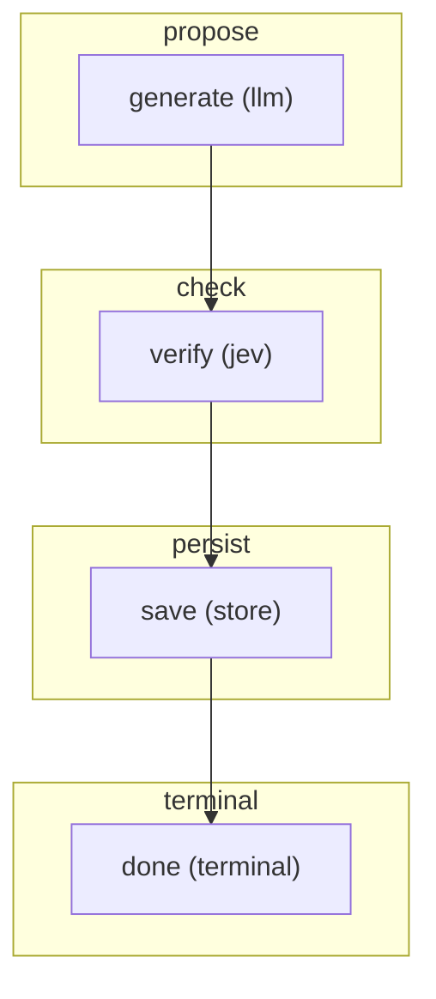

# FLOW — document_learning

> Generated from the flow module's `CONTRACT` (`jav/contract.py`, `python -m jav.cli flows`).
> Regenerate this file instead of editing it. FLOW.mmd groups the graph by phase.

## Phases and steps

### propose
- **generate** _(llm)_ — Explicit Pydantic AI modell vagy importált javaslat; saját tartós válasz.

### check
- **verify** _(jev)_ — Forráshű adatpontok; futásonkénti válasznapló, nyers valószínűségekkel.

### persist
- **save** _(store)_ — Megváltoztathatatlan eredmény; ismételt azonos írás idempotens.

### terminal
- **done** _(terminal)_ — Mentve; a dokumentum teljessége továbbra sem bizonyított.

Terminal steps: done

> Kísérleti, UTF-8 szöveges bemenet. A tartós futtató: jav.learning_runtime.run_learning. Munkakönyvtáranként egy futtató; nincs típusaktiválás vagy automatikus személyesadat-küldés.

## Graph (Mermaid)

