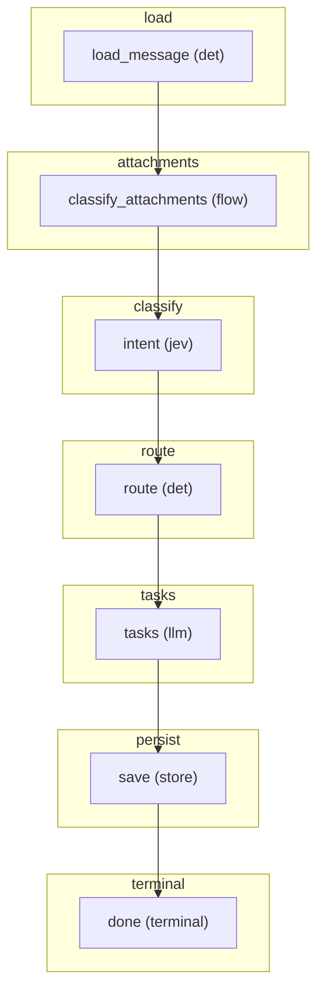

# FLOW — email_intent

> Generated from the flow module's `CONTRACT` (`jav/contract.py`, `python -m jav.cli flows`).
> Regenerate this file instead of editing it. FLOW.mmd groups the graph by phase.

## Phases and steps

### load
- **load_message** _(det)_ — inbox/<mailbox>/<msgid>/message.json + fájlok, vagy kész EmailMessage (golden)

### attachments
- **classify_attachments** _(flow)_ — minden PDF-csatolmányon az M1 doc_detect gráf (a levél run_id-je alatt: <run_id>-doc_detect), eredmény a csatolmányra + documents.source_email; kép -> unsupported, névből ismert -> name_only; olvashatatlan PDF -> unreadable + teendő (attachment:unreadable), a levél tovább fut

### classify
- **intent** _(jev)_ — egy kérés: Choice intent (11 szándék, a küldő célja) + 4 Noul jel; tisztított törzs + kód-oldali feature-ök a state-ben. Without JEV: the same questions to GPT in one structured request, the confidence from the answer's token log-probabilities (jav/intent_gpt.py); a failed call is an intent:gpt_failed to-do (and no attachment recognition in this flow: the attachments are recognised as items of their own)

### route
- **route** _(det)_ — policy.email_next_flow: conf küszöb -> csatolmány M1-típusa -> szándékonkénti alapértelmezés

### tasks
- **tasks** _(llm)_ — feladatjavaslat (GPT, a régi email-actions v1.3.0 utasítása) + kódos bizonyíték-kapu; csak ha a recept kéri, archiválandó levélen nem; javaslat -> teendő (ember fogadja el)

### persist
- **save** _(store)_ — emails + email_results (a futás sora, a feladatjavaslat is); bizonytalan intent / javaslat -> review_queue (additív), különben a korábbi tétel zárul

### terminal
- **done** _(terminal)_ — szándék + next_flow mentve

Terminal steps: done

> M3 - a bemenet a régi outlook_bridge.ps1 -> jav/ingest_server.py -> inbox-mappa; a next_flow kódban dől el, nem Jev-kérdés.

## Graph (Mermaid)

