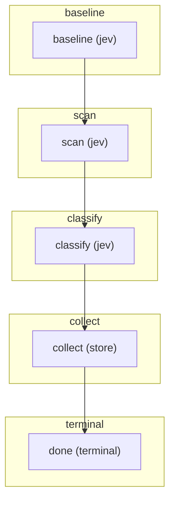

# FLOW — email_learning

> A flow-modul `CONTRACT`-jából generálva (`jav/contract.py`, `python -m jav.cli flows`). Ne szerkeszd kézzel -
> generáld újra. A fázisonként csoportosított gráf a FLOW.mmd.

## Fázisok és lépések

### baseline
- **baseline** _(jev)_ — Változatlan M3-kérdések az új mintán; saját válasznapló.

### scan
- **scan** _(jev)_ — Minden olvasható forrás minden része; pontos helyek és nyers relevancia.

### classify
- **classify** _(jev)_ — Szándék eredeti törzs- és csatolmányrészletekből; nincs típusaktiválás.

### collect
- **collect** _(store)_ — Jelölt, eltérések, forráshiány, ellenőrzési okok; még nem etalon.

### terminal
- **done** _(terminal)_ — Tartós kísérleti eredmény; kézi címkézés külön parancs.

Terminális lépések: done

> Opt-in M3-próba: jav.email_learning_runtime; üzemi út és küszöbök változatlanok.

## Gráf (Mermaid)

