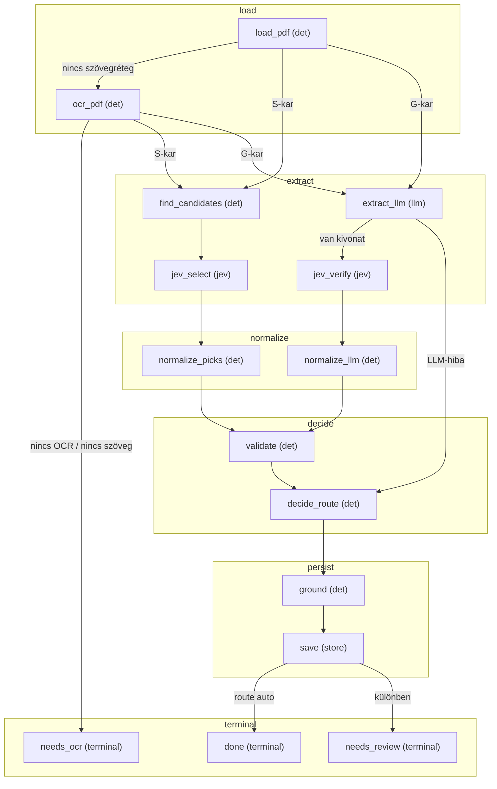

# FLOW — invoice

> A flow-modul `CONTRACT`-jából generálva (`jav/contract.py`, `python -m jav.cli flows`). Ne szerkeszd kézzel -
> generáld újra. A fázisonként csoportosított gráf a FLOW.mmd.

## Fázisok és lépések

### load
- **load_pdf** _(det)_ — pdfplumber szó-szintű rekonstrukció, sha256 doc_id; szövegréteg-teszt; a szóréteg (szókeretek) mentése
- **ocr_pdf** _(det)_ — szöveg nélküli PDF: oldalkép (pypdfium2) + tesseract szó-dobozok (natív / régi sidecar-kép) -> ugyanaz a sor- és cella-építés; a szóréteg mentése; lemez-gyorsítótár runs/ocr/; minőségjelek nyersen, gyenge OCR review-ok (policy ocr)

### extract
- **find_candidates** _(det)_ — S-kar: determinisztikus, sorrendezett, maszkoló jelöltkeresők a csomag jelölt-profiljával (hu / intl): iban -> tax_id -> date -> invoice_number -> money; nevek/címek cellákon
- **jev_select** _(jev)_ — S-kar: kötegelt Choice-kérések (parties / header / money) a csomag select-hívási helyéről, fókuszált state, none mindig opció, jelenlét-Noul mezőnként (jelölt nélkül is, a vizsgált nem kötelező mezőkre, csak meglévő kérésben)
- **extract_llm** _(llm)_ — G-kar: gpt kivonat a csomag régi promptjával + sémájával (Pydantic AI), az egyetlen generatív lépés
- **jev_verify** _(jev)_ — G-kar: evidencia-illesztés kódban (unsupported), majd Noul fan-out egy kérésben (off_target, wrong_kind, incomplete, absence_wrong, parties_swapped, tételsorok) a csomag verify-hívási helyéről

### normalize
- **normalize_picks** _(det)_ — S-kar: label -> típusos érték a csomag mező-fajtái szerint (Decimal, date), kód-oldali konzisztencia-okok
- **normalize_llm** _(det)_ — G-kar: kivonat-szótár -> normalizált rekord a csomag mező-fajtái szerint

### decide
- **validate** _(det)_ — a csomag validátor-listája (a régi rules.json): áfa-egyenlet, dátumsorrend, adószám-ellenőrzőszám, IBAN mod-97, formátum-regexek
- **decide_route** _(det)_ — policy.decide: küszöbök (configs/policy.json), a csomag kötelező / magas tétű mezői, additív review-latch -> auto | human

### persist
- **ground** _(det)_ — mezőnkénti forráshely a szórétegen (S: a kiválasztott jelölt sora + a többi jelölt; G: kódos keresés címkével, configs/grounding.json); hiba esetén forráshely nélkül tovább
- **save** _(store)_ — documents + datapoints (mezőnkénti confidence, a hívási hely config_hash-e) + review_queue

### terminal
- **done** _(terminal)_ — auto - elfogadva
- **needs_review** _(terminal)_ — human - review-sorban, okokkal
- **needs_ocr** _(terminal)_ — szöveg nélküli PDF, és az OCR sem adott használható szöveget (vagy nincs OCR-motor): documents has_text=0; teendő (felvevő `ocr`, ocr:*), a szöveges mentés zárja

Terminális lépések: done, needs_review, needs_ocr

> M2 invoice - két kar egy gráfban (S = jelöltek + Jev Choice, G = gpt + Jev Noul); egyetértés = auto, eltérés = review. Típus-független: a típus-csomag (configs/types/<típus>.json: invoice_hu, invoice_foreign, a közmű-számlák) adja a mezőket, kérdéseket, promptot, validátorokat. Szöveg nélküli PDF-nél OCR-lépés (ocr_pdf) ugyanarra az elrendezésre. Minden AI-hívás az adapteren (cache + ledger + config_hash).

## Gráf (Mermaid)

