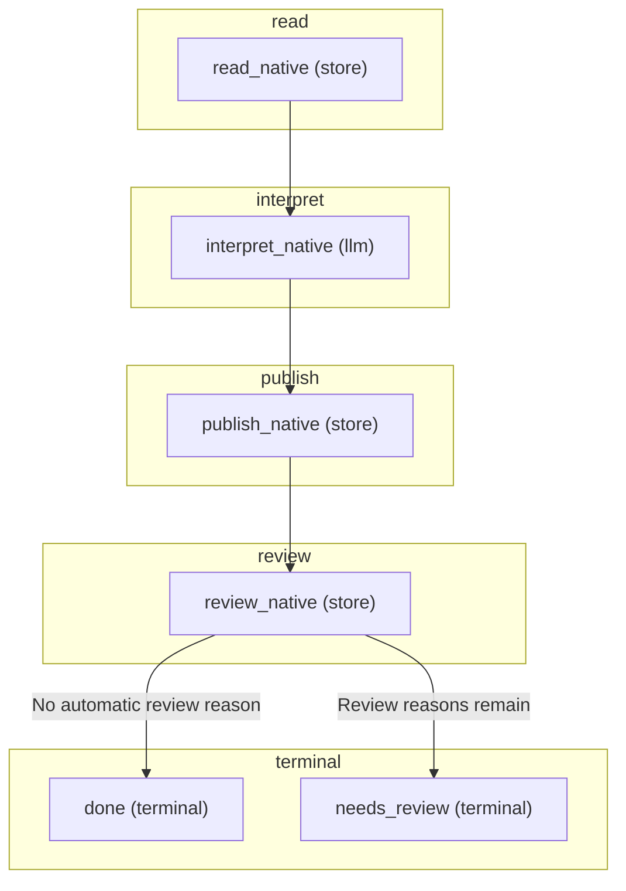

# FLOW — native

> Generated from the flow module's `CONTRACT` (`jav/contract.py`, `python -m jav.cli flows`).
> Regenerate this file instead of editing it. FLOW.mmd groups the graph by phase.

## Phases and steps

### read
- **read_native** _(store)_ — Verify the frozen source and save the complete bounded native Delivery; OCR is disabled, except for a scanned PDF continuing from detection: it takes over detection's Azure recognition, or one asked for within the run's Azure budget, otherwise the reader's local OCR.

### interpret
- **interpret_native** _(llm)_ — Use the shared GPT receipt and budget boundary, with optional JEV support; persist a terminal outcome reference.

### publish
- **publish_native** _(store)_ — Verify saved evidence and publish exactly once for the frozen run item.

### review
- **review_native** _(store)_ — Add reading, interpretation, grounding and content-check gaps and no-band JEV support to the existing review queue.

### terminal
- **done** _(terminal)_ — A published machine result; human approval remains separate.
- **needs_review** _(terminal)_ — Published evidence and explicit gaps or provider outcomes remain available for review.

Terminal steps: done, needs_review

> Immutable source readings, terminal interpretation outcomes and publications remain separate. Resume uses saved identities, without copying source text into Burr state. A text PDF whose recognised type has no fitting type pack can continue here from document detection (120, recipe setting unknown_documents).

## Graph (Mermaid)

