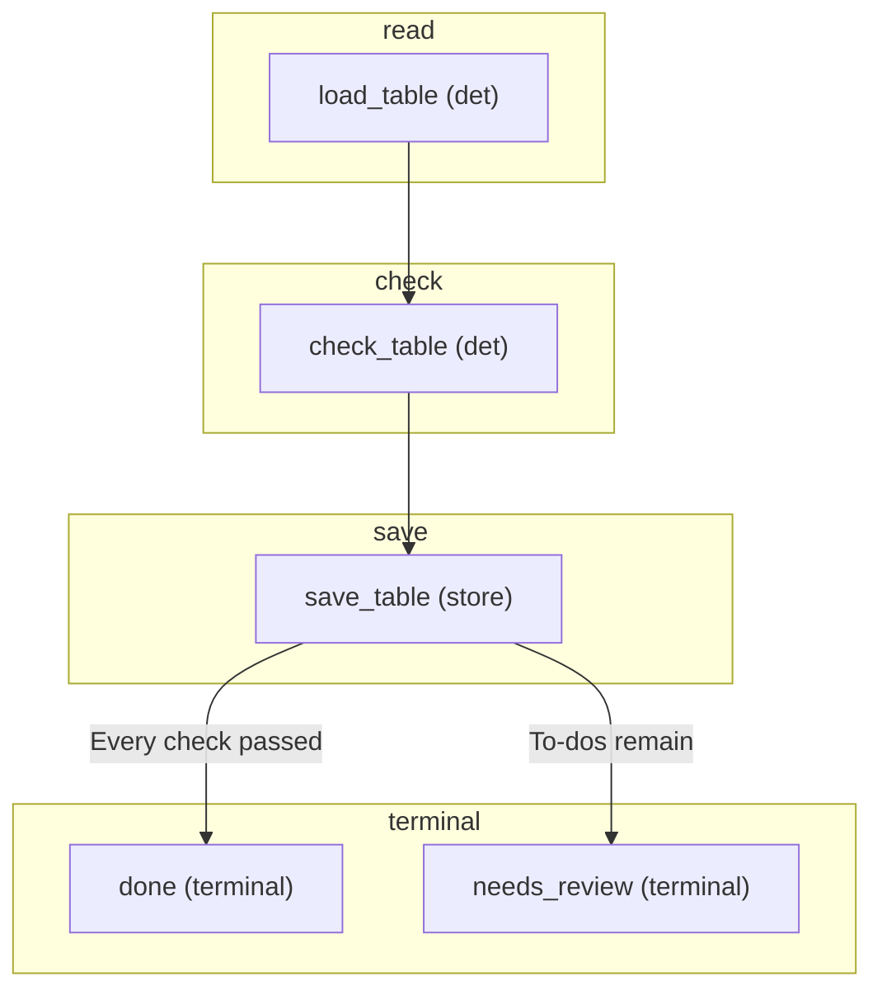

# FLOW — statement_table

> Generated from the flow module's `CONTRACT` (`jav/contract.py`, `python -m jav.cli flows`).
> Regenerate this file instead of editing it. FLOW.mmd groups the graph by phase.

## Phases and steps

### read
- **load_table** _(det)_ — Verify the account's statement file against the run's frozen fingerprint and load the statement the reader built from the export (jav/statement_table.py).

### check
- **check_table** _(det)_ — The type pack's checks (running balance, closing balance, totals, period dates); a failed check, a missing required field and a line the reader could not read are to-dos.

### save
- **save_table** _(store)_ — Save the statement as the item's document and data points, so the reconciliation reads it like an extracted statement; the to-dos go into the review queue.

### terminal
- **done** _(terminal)_ — Every check passed; human approval remains separate.
- **needs_review** _(terminal)_ — A check failed or a line could not be read; the statement is saved with its to-dos.

Terminal steps: done, needs_review

> No model is called. The statement file is derived from a bank's tabular export when a person adds the accounts they chose to a work package (DECISIONS 132, 136).

## Graph (Mermaid)

